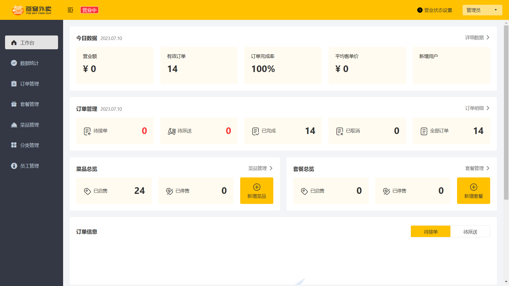
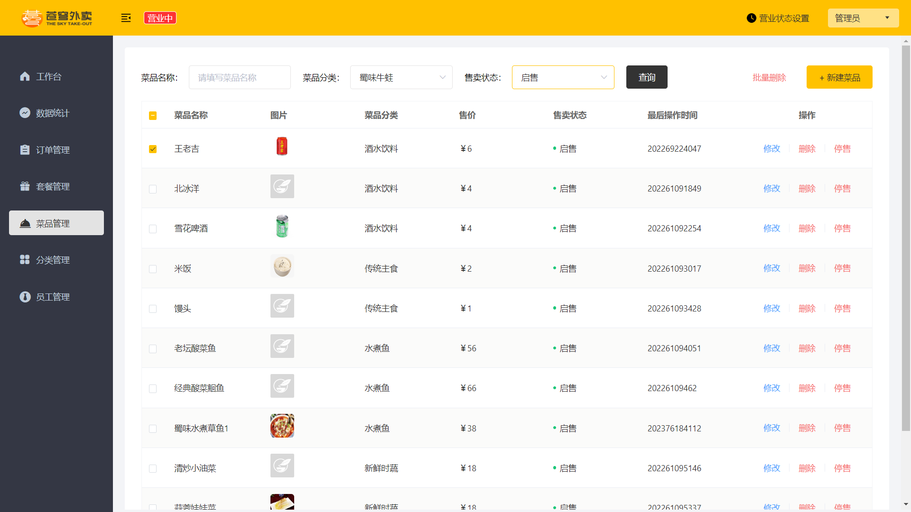
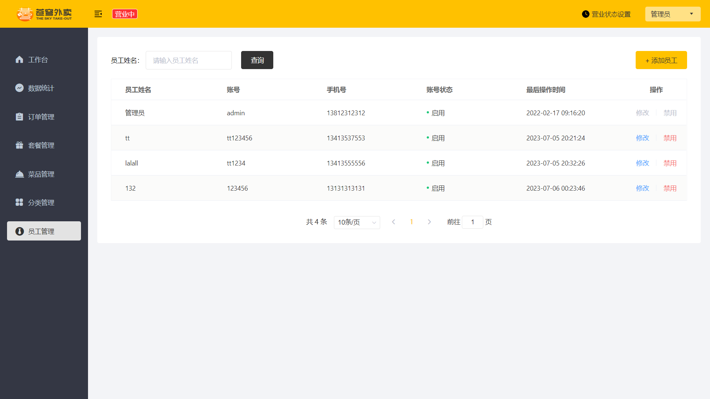

# 基于疫情封宿的校园点餐系统项目介绍

该项目是一个为高校餐厅定制的在线外卖订购系统，以解决疫情封宿期间学生无法外出就餐的问题。用户可以通过网站、手机 APP 或者微信小程序订购餐点，餐厅可以注册账号并进行菜单管理，后台管理员可以管理餐厅和用户账号信息，处理订单和投诉，生成销售报表等。

## 项目概述

该项目提供以下主要功能：
- 用户注册和登录账号，浏览餐厅列表，选择菜单，并下单和支付；
- 餐厅注册账号并进行菜单管理，接收和处理订单；
- 后台管理员可以管理餐厅和用户账号信息，处理订单和投诉，生成销售报表等。

## 项目架构

项目的整体架构分为前端和后端，采用前后端分离开发模式。

### 前端技术选型

- **网站和小程序开发**：H5、Vue.js、ElementUI、微信小程序
- **数据可视化**：Apache ECharts

### 后端技术选型

- **框架**：Spring Boot、Spring MVC
- **数据库**：MySQL、Redis
- **数据持久化**：MyBatis
- **缓存**：Spring Cache、Spring Data Redis
- **安全认证**：JWT
- **其他工具**：HttpClient、Swagger、阿里云OSS、POI、WebSocket

### 工具

- **版本控制**：Git
- **项目构建**：Maven
- **单元测试**：JUnit
- **接口测试**：Postman

## 功能模块

项目中的业务功能模块分为管理端和用户端两大模块，模块内功能细分如下：

### 管理端

- 登录/退出
- 员工管理
- 分类管理
- 菜品管理
- 套餐管理
- 订单管理
- 数据统计

### 用户端

- 登录/退出
- 点餐-菜单
- 点餐-购物车
- 订单支付
- 个人信息

## 项目管理端截图

## 联系方式

如果有任何问题或建议，欢迎通过邮件联系：zhujiacai2020@gmail.com