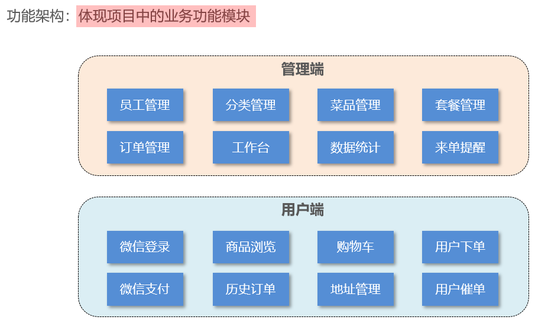
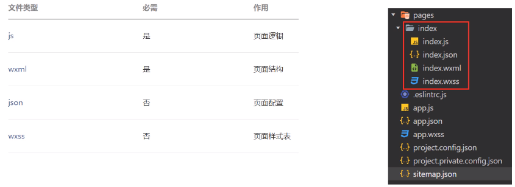

# 基于SSM框架的外卖点餐系统的设计

## 项目整体介绍

### 项目概述

#### 项目介绍




#### 产品原型


#### 技术选型


### 环境搭建


#### 前端环境搭建


#### 后端环境搭建


#### 数据库搭建


#### 前后端联调


#### Nginx


### 技术完善

#### 密码加密

- 将密码加密后存储，提高安全性
- 使用 `MD5` 加密方式对明文密码加密

`MD5` 信息摘要算法（英语：`MD5 Message-Digest Algorithm`），一种被广泛使用的密码散列函数，可以产生出一个 `128` 位（`16` 字节）的散列值（`hash value`），用于确保信息传输完整一致。`MD5` 由美国密码学家罗纳德·李维斯特（`Ronald Linn Rivest`）设计，于 `1992` 年公开，用以取代 `MD4` 算法。这套算法的程序在 `RFC 1321` 标准中被加以规范。`1996` 年后该算法被证实存在弱点，可以被加以破解，对于需要高度安全性的数据，专家一般建议改用其他算法，如 `SHA-2`。`2004` 年，证实 `MD5` 算法无法防止碰撞（`collision`），因此不适用于安全性认证，如 `SSL` 公开密钥认证或是数字签名等用途。


1. 修改数据库中明文密码，改为 `MD5` 加密后的密文
2. 修改 `Java` 代码，前端提交的密码进行 `MD5` 加密后再跟数据库中的密码比对

```java
//密码比对
String passwordMD5 = DigestUtils.md5DigestAsHex(password.getBytes());
if (!passwordMD5.equals(employee.getPassword())) {
    //密码错误
    throw new PasswordErrorException(MessageConstant.PASSWORD_ERROR);
}
```

`TODO`：标注的意思是还需要改进的代码


由于 `MD5` 不安全，我们可以采用 `BCryptPasswordEncoder` 来加密

1. 导入依赖包

```xml
<!-- https://mvnrepository.com/artifact/org.springframework.security/spring-security-crypto -->
<dependency>
    <groupId>org.springframework.security</groupId>
    <artifactId>spring-security-crypto</artifactId>
    <version>6.1.0</version>
</dependency>
```

2. 添加加密器

在 `SpringBoot` 项目的配置文件中添加如下代码，用于注入 `BCryptPasswordEncoder` 加密器

```java
@Configuration
public class PasswordEncoderConfiguration {

    @Bean
    public BCryptPasswordEncoder passwordEncoder(){
        return new BCryptPasswordEncoder();
    }
}
```

3. 验证密码

在需要验证密码的地方，注入密码加密器，然后使用 `BCryptPasswordEncoder` 的 `matches` 方法进行匹配

```java
//密码比对
if (!passwordEncoder.matches(password,employee.getPassword())) {
    //密码错误
    throw new PasswordErrorException(MessageConstant.PASSWORD_ERROR);
}
```

加密方法：用于更改密码时将用户输入的明文密码进行加密

- `encode(明文密码)`

匹配方法：用于比较输入的密码加密后与数据库中已加密的密码进行比对

- `matches(用户输入的未加密的密码,数据库中已加密的密码)`

#### MapStruct

`mapstruct` 是一种实体类映射框架，能够通过 `Java` 注解将一个实体类的属性安全地赋值给另一个实体类。有了 `mapstruct`，只需要定义一个映射器接口，声明需要映射的方法，在编译过程中，`mapstruct` 会自动生成该接口的实现类，实现将源对象映射到目标对象的效果。

导入依赖包

```xml
<dependency>
    <groupId>org.mapstruct</groupId>
    <artifactId>mapstruct</artifactId>
    <version>1.5.3.Final</version>
</dependency>
<dependency>
    <groupId>org.mapstruct</groupId>
    <artifactId>mapstruct-processor</artifactId>
    <version>1.5.3.Final</version>
</dependency>
```

如果出现错误：`Cannot find implementation for com.sky.mapper.EmployeeMapper`，可以配置下面内容

```xml
<build>
    <plugins>
        <!-- maven-compiler-plugin 插件，解决 Lombok + MapStruct 组合 -->
        <plugin>
            <groupId>org.apache.maven.plugins</groupId>
            <artifactId>maven-compiler-plugin</artifactId>
            <version>${maven-compiler-plugin.version}</version>
            <configuration>
                <annotationProcessorPaths>
                    <path>
                        <groupId>org.projectlombok</groupId>
                        <artifactId>lombok</artifactId>
                        <version>${lombok}</version>
                    </path>
                    <path>
                        <groupId>org.mapstruct</groupId>
                        <artifactId>mapstruct-processor</artifactId>
                        <version>${mapstruct}</version>
                    </path>
                </annotationProcessorPaths>
            </configuration>
        </plugin>
    </plugins>
</build>
```

#### 参数校验

导入依赖：父工程有 `spring-boot-starter` 依赖子工程只需要引入下面依赖

```xml
<!-- @Validated参数校验 -->
<dependency>
    <groupId>org.springframework.boot</groupId>
    <artifactId>spring-boot-starter-validation</artifactId>
</dependency>
```

实体类定义要校验的参数

```java
@Data
@ApiModel("新增员工传输对象")
@ToString
public class EmployeeDTO implements Serializable {
    private static final long serialVersionUID = 1L;

    @ApiModelProperty(value = "工号/登录账号", position = 1)
    @NotNull(message = "工号不可为空")
    private String username;
    @ApiModelProperty(value = "员工姓名",position = 2)
    @NotNull(message = "姓名不可为空")
    private String name;
    @ApiModelProperty(value = "手机号",position = 3)
    @NotNull(message = "手机号不可为空")
    private String phone;
    @ApiModelProperty(value = "性别",position = 4)
    @NotNull(message = "性别不可为空")
    private String sex;
    @ApiModelProperty(value = "身份证")
    @NotNull(message = "身份证号不可为空")
    private String idNumber;
}
```

在 `controller` 的入参处添加 `@Validated` 注解

```java
@ApiOperation(value = "新增员工")
@PostMapping("employee/add")
public Result<Boolean> newEmployee(@RequestBody@Validated EmployeeDTO employeeDTO){
    return Result.success(employeeService.newEmployee(employeeDTO));
}
```

编写处理返回的异常信息

```java
/**
 * 全局异常处理器，处理项目中抛出的业务异常
 */
@RestControllerAdvice
@Slf4j
public class GlobalExceptionHandler {
    /**
     * 处理@Validated参数校验异常
     */
    @ExceptionHandler
    public Result exceptionHandler(MethodArgumentNotValidException ex){
        BindingResult result = ex.getBindingResult();
        StringBuffer stringBuffer = new StringBuffer();
        if(result.hasErrors()){
            List<ObjectError> allErrors = result.getAllErrors();
            if(CollUtil.isNotEmpty(allErrors)){
                allErrors.forEach(p->{
                    FieldError fieldError = (FieldError) p;
                    log.warn("Bad Request Parameters: dto entity [{}],field [{}],message [{}]",fieldError.getObjectName(), fieldError.getField(), fieldError.getDefaultMessage());
                    stringBuffer.append(fieldError.getDefaultMessage());
                });
            }
        }
        return Result.error(stringBuffer.toString());
    }
}
```

### 接口文档


使用 `Swagger` 你只需要按照它的规范去定义接口及接口相关的信息，就可以做到生成接口文档，以及在线接口调试页面。

官网：https://swagger.io/

[K](https://doc.xiaominfo.com/)[nife4j](https://doc.xiaominfo.com/)[ ](https://doc.xiaominfo.com/)是为 `Java MVC` 框架集成 `Swagger` 生成 `Api` 文档的增强解决方案。

```xml
<!-- https://mvnrepository.com/artifact/com.github.xiaoymin/knife4j-spring-boot-starter -->
<dependency>
    <groupId>com.github.xiaoymin</groupId>
    <artifactId>knife4j-spring-boot-starter</artifactId>
    <version>3.0.3</version>
</dependency>
```

#### 使用方式

1. 导入 `knife4j` 的 `maven` 坐标

2. 在配置类中加入 `knife4j` 相关配置

3. 设置静态资源映射，否则接口文档页面无法访问

   在 `WebMvcConfiguration` 配置类中配置以下内容

```java
/**
 * 配置类，注册web层相关组件
 */
@Configuration
@Slf4j
public class WebMvcConfiguration extends WebMvcConfigurationSupport {

    @Autowired
    private JwtTokenAdminInterceptor jwtTokenAdminInterceptor;

    /**
     * 通过knife4j生成接口文档
     * @return
     */
    @Bean
    public Docket docket() {
        ApiInfo apiInfo = new ApiInfoBuilder()
            .title("苍穹外卖项目接口文档")
            .version("2.0")
            .description("苍穹外卖项目接口文档")
            .build();
        Docket docket = new Docket(DocumentationType.SWAGGER_2)
            .apiInfo(apiInfo)
            .select()
            .apis(RequestHandlerSelectors.basePackage("com.sky.controller"))
            .paths(PathSelectors.any())
            .build();
        return docket;
    }

    /**
     * 设置静态资源映射
     * @param registry
     */
    protected void addResourceHandlers(ResourceHandlerRegistry registry) {
        registry.addResourceHandler("/doc.html").addResourceLocations("classpath:/META-INF/resources/");
        registry.addResourceHandler("/webjars/**").addResourceLocations("classpath:/META-INF/resources/webjars/");
    }
}
```

#### 常用注解

通过注解可以控制生成的接口文档，使接口文档拥有更好的可读性，常用注解如下：


#### 接口分类

用于区分用户端接口跟客户端接口，分成两部分

```java
/**
 * 配置类，注册web层相关组件
 */
@Configuration
@Slf4j
public class WebMvcConfiguration extends WebMvcConfigurationSupport {
	
    ......

    /**
     * 通过knife4j生成接口文档
     * @return
     */
    @Bean
    public Docket adminDocket() {
        ApiInfo apiInfo = new ApiInfoBuilder()
                .title("苍穹外卖项目接口文档")
                .version("2.0")
                .description("苍穹外卖项目接口文档")
                .build();
        Docket adminDocket = new Docket(DocumentationType.SWAGGER_2)
                .groupName("管理端接口")
                .apiInfo(apiInfo)
                .select()
                .apis(RequestHandlerSelectors.basePackage("com.sky.controller.admin"))
                .paths(PathSelectors.any())
                .build();
        return adminDocket;
    }
    @Bean
    public Docket userDocket() {
        ApiInfo apiInfo = new ApiInfoBuilder()
                .title("苍穹外卖项目接口文档")
                .version("2.0")
                .description("苍穹外卖项目接口文档")
                .build();
        Docket userDocket = new Docket(DocumentationType.SWAGGER_2)
                .groupName("用户端接口")
                .apiInfo(apiInfo)
                .select()
                .apis(RequestHandlerSelectors.basePackage("com.sky.controller.user"))
                .paths(PathSelectors.any())
                .build();
        return userDocket;
    }
    ......
}
```

## 员工模块完善

### 新增员工

- `EmployeeController`

  ```java
  /**
   * 员工管理
   */
  @RestController
  @RequestMapping("/admin/employee")
  @Api(tags = "员工相关接口")
  @Slf4j
  public class EmployeeController {
  
      @Autowired
      private EmployeeService employeeService;
      ......
  
      @ApiOperation(value = "新增员工")
      @PostMapping("")
      public Result<Boolean> newEmployee(@RequestBody@Validated EmployeeDTO employeeDTO){
          return Result.success(employeeService.newEmployee(employeeDTO));
      }
  }
  ```

- `EmployeeServiceImpl`

  ```java
  @Service
  
  public class EmployeeServiceImpl implements EmployeeService {
  
  	......
      /**
       * 新增员工
       * @param employeeDTO
       * @return
       */
      @Override
      public Boolean newEmployee(EmployeeDTO employeeDTO) {
  
  //        EmployeePO otherEmployee = employeeMapperRepository.selectOne(new LambdaQueryWrapper<EmployeePO>()
  //                .eq(EmployeePO::getIdNumber, employeeDTO.getIdNumber())
  //                .last("limit 1"));
  //        if (ObjectUtil.isNotNull(otherEmployee)){
  //            throw new BaseException("身份证信息已存在");
  //        }
  
          EmployeePO employeePO = EmployeeMapper.INSTANCE.DTOConvertPO(employeeDTO);
          //设置账号的状态,默认正常状态(1:正常,0:异常)
          employeePO.setStatus(StatusConstant.ENABLE);
          //设置密码,默认123456
          employeePO.setPassword(passwordEncoder.encode("123456"));
          //设置当前记录创建时间和修改时间
          employeePO.setCreateTime(LocalDateTime.now());
          employeePO.setUpdateTime(LocalDateTime.now());
          //设置当前创建人id和修改人id
          employeePO.setCreateUser(BaseContext.getCurrentId());
          employeePO.setUpdateUser(BaseContext.getCurrentId());
  
          return employeeMapperRepository.insert(employeePO)!=0;
      }
  }
  ```

  

#### 用户名已存在，抛出异常后未处理

在全局异常类中设置异常捕获机制，捕获异常 `SQLIntegrityConstraintViolationException` 并处理

```java
/**
  * 处理SQL异常：重复值
  * @param ex
  * @return
*/
@ExceptionHandler
public Result exceptionHandler(SQLIntegrityConstraintViolationException ex){
    //Duplicate entry '32323' for key 'idx_username'
    String message = ex.getMessage();
    if(message.contains("Duplicate entry")){
        String[] s = message.split(" ");
        String username = s[2];
        String msg = username + MessageConstant.ALREADY_EXISTS;
        return Result.error(msg);
    }else {
        return Result.error(MessageConstant.UNKNOWN_ERROR);
    }
}
```

可以将索引的名改为所需要的内容，抛出异常直接提取


然后捕获异常并处理

```java
/**
 * 处理SQL异常：重复值
 * @param ex
 * @return
*/
@ExceptionHandler
public Result exceptionHandler(SQLIntegrityConstraintViolationException ex){
    //Duplicate entry '32323' for key '用户名'
    //    0       1      2     3   4     5
    String message = ex.getMessage();
    if(message.contains("Duplicate entry")){
        String[] s = message.split(" ");
        String msgValue = s[2];
        String msgName = s[5];
        String msg = msgName.replace("'","") + ":" + msgValue.replace("'","") + "," + MessageConstant.ALREADY_EXISTS;
        return Result.error(msg);
    }else {
        return Result.error(MessageConstant.UNKNOWN_ERROR);
    }
}
```

如果重复的字段没有设置主机或者唯一值，则需要在业务中去判断

#### 新增员工，创建人 id 获取

新增员工时，创建人 `id` 和修改人 `id` 设置为了固定值

- `ThreadLocal` 并不是一个 `Thread`，而是 `Thread` 的局部变量

- `ThreadLocal` 为每个线程提供单独一份存储空间，具有线程隔离的效果，只有在线程内才能获取到对应的值，线程外则不能访问

- `ThreadLocal` 常用方法：

  - `public void set(T value)`：设置当前线程的线程局部变量的值
  - `public T get()`：返回当前线程所对应的线程局部变量的值
  - `public void remove()`：移除当前线程的线程局部变量

- 封装的 `ThreadLocal` 方法，便于维护和使用

  ```java
  public class BaseContext {
      public static ThreadLocal<Long> threadLocal = new ThreadLocal<>();
      public static void setCurrentId(Long id) {
          threadLocal.set(id);
      }
      public static Long getCurrentId() {
          return threadLocal.get();
      }
      public static void removeCurrentId() {
          threadLocal.remove();
      }
  }
  ```

1. 在校验 `jwt` 令牌时将用户的登录信息提取出来，将登录用户 `id` 放入到 `ThreadLocal` 中

   

2. 在需要用到的地方获取

   

### 员工查询

#### PageHapler分页

导入依赖：

```xml
<dependency>
    <groupId>com.github.pagehelper</groupId>
    <artifactId>pagehelper-spring-boot-starter</artifactId>
    <version>1.4.5</version>
</dependency>
```

接口

```java
/**
 * 按条件分页查询员工
 * @param source
 * @return
*/
@ApiOperation(value = "按条件分页查询员工")
@GetMapping("/page")
public Result<PageResult> pageQuery(EmployeePageQueryDTO source){
    return Result.success(employeeService.pageQuery(source));
}
```

返回值 `PageResult`

```java
/**
 * 封装分页查询结果
 */
@Data
@AllArgsConstructor
@NoArgsConstructor
public class PageResult implements Serializable {
    private long total; //总记录数
    private List records; //当前页数据集合
}
```

查询参数

```java
@Data
public class EmployeePageQueryDTO implements Serializable {
    //员工姓名
    private String name;
    //页码
    private int page;
    //每页显示记录数
    private int pageSize;
}
```

接口实现类

```java
/**
     * 按条件分页查询员工
     * @param source
     * @return
     */
@Override
public PageResult pageQuery(EmployeePageQueryDTO source) {
    PageHelper.startPage(source.getPage(),source.getPageSize());
    if(StrUtil.isBlank(source.getName())){
         source.setName("");
    }
    List<EmployeePO> employees = employeeMapperRepository.selectList(new 								LambdaQueryWrapper<EmployeePO>()
                  .like(EmployeePO::getName, source.getName()));
    //隐藏密码
    employees.forEach(e->e.setPassword(""));
    PageInfo<EmployeePO> pageInfo = new PageInfo<>(employees);
    return new PageResult(pageInfo.getTotal(),pageInfo.getList());
}

/**
 * 或者使用Page
 */
@Override
    public PageResult pageQuery(EmployeePageQueryDTO source) {
        PageHelper.startPage(source.getPage(),source.getPageSize());
        List<EmployeePO> employees = employeeMapperRepository.selectList(new LambdaQueryWrapper<EmployeePO>()
                .like(EmployeePO::getName, source.getName()));
        //隐藏密码
        employees.forEach(e->e.setPassword(""));
        Page<EmployeePO> page = (Page<EmployeePO>) employees;
        return new PageResult(page.getTotal(),page.Result());
    }
```

#### Page 和 PagInfo

1. 两者都能获取到数据

2. `Page` 是一个 `ArrayList`

   ```java
   public class Page<E> extends ArrayList<E>
   ```

3. `PageInfo` 是一个对象，能获取到的数据比 `Page` 多

   ```java
   public class PageInfo<T> extends PageSerializable<T>
   ```

`Page` 对象：

```java
public List<E> getResult; //获取当前页的数据
private int pageNum;	//当前页码
private int pageSize; 	//每页数据的数量
private int startRow;	//始页首行行号
private int endRow;		//尾页尾行行号
private long total;		//总记录数
private int pages;		//总页数
private Boolean reasonable; //分页合理化
private Boolean pageSizeZero; //当设置为true的时候，如果pagesize设置为0（或RowBounds的limit=0），就不执行分页，返回全部结果
```

`PageInfo` 对象：

```java
    private int pageNum;   			//当前页
    private int pageSize;			//每页显示数据条数
    private int size;				//当前页的数量
    private int startRow; 			//始页首行行号
    private int endRow;				//尾页尾行行号
    private long total;				//总记录数
    private int pages;				//总页数
    private List<T> list;			//查询结果的数据
    private int firstPage;			//首页
    private int prePage;			//上一页
    private int nextPage;			// 下一页
    private int lastPage;			//最后一页
    private boolean isFirstPage;	//是不是第一页
    private boolean isLastPage;		//是不是最后一页
    private boolean hasPreviousPage;//有没有上一页
    private boolean hasNextPage;	//有没有下一页
    private int navigatePages;		//所有导航页号
    private int[] navigatepageNums;	//导航页码数
```

#### 分页冲突

由于该项目使用的是 `MybatisPlus` 可能会有依赖跟分页插件 `pagehelper` 有冲突


所以该项目直接使用 `MybatisPlus` 中的分页插件

1. 在 `MybatisPlus` 的配置类中注册插件

   ```java
   /**
    * @Content: MyBaitsPlus配置类
    * @Author: Asen
    * @Date: 2023/8/31 11:48
    */
   @Slf4j
   @Configuration
   public class MyBatisPlusConfig {
   
       /**
        * 分页插件
        */
       @Bean
       public MybatisPlusInterceptor mybatisPlusInterceptor(){
           MybatisPlusInterceptor mybatisPlusInterceptor = new MybatisPlusInterceptor();
           mybatisPlusInterceptor.addInnerInterceptor(new PaginationInnerInterceptor(DbType.MYSQL));
           return mybatisPlusInterceptor;
       }
   }
   ```

2. 使用案例

   ```java
   /**
        * 菜品分页查询
        * @param source
        * @return
        */
   @Override
   public PageResult page(DishPageQueryDTO source) {
       Page<DishVO> page = new Page<>(source.getPage(),source.getPageSize());
       dishRepository.page(page,source);
       return new PageResult(page.getTotal(), page.getRecords());
   }
   ```

#### 时间格式

访问接口，请求数据发现返回的时间格式是一个数组形式，需要规定将其转为规范格式


解决方式

1. 在属性上加入注解，对日期进行格式化：`@JsonFormat(pattern = "yyyy-MM-dd HH:mm:ss")`

   ```java
   @Data
   @NoArgsConstructor
   @AllArgsConstructor
   @TableName("employee")
   public class EmployeePO implements Serializable {
   
       private static final long serialVersionUID = 1L;
       ......
   
       @JsonFormat(pattern = "yyyy-MM-dd HH:mm:ss")
       private LocalDateTime createTime;
   
       @JsonFormat(pattern = "yyyy-MM-dd HH:mm:ss")
       private LocalDateTime updateTime;
   
       ......
   }
   ```

2. 在 `WebMvcConfiguration` 中扩展 `SpringMVC` 的消息转换器，统一对日期类型进行格式化处理

   1. 编写 `Json` 日期类型对象转换器

      ```java
      /**
       * 对象映射器:基于jackson将Java对象转为json，或者将json转为Java对象
       * 将JSON解析为Java对象的过程称为 [从JSON反序列化Java对象]
       * 从Java对象生成JSON的过程称为 [序列化Java对象到JSON]
       */
      public class JacksonObjectMapper extends ObjectMapper {
      
          public static final String DEFAULT_DATE_FORMAT = "yyyy-MM-dd";
          //public static final String DEFAULT_DATE_TIME_FORMAT = "yyyy-MM-dd HH:mm:ss";
          public static final String DEFAULT_DATE_TIME_FORMAT = "yyyy-MM-dd HH:mm";
          public static final String DEFAULT_TIME_FORMAT = "HH:mm:ss";
      
          public JacksonObjectMapper() {
              super();
              //收到未知属性时不报异常
              this.configure(FAIL_ON_UNKNOWN_PROPERTIES, false);
      
              //反序列化时，属性不存在的兼容处理
              this.getDeserializationConfig().withoutFeatures(DeserializationFeature.FAIL_ON_UNKNOWN_PROPERTIES);
      
              SimpleModule simpleModule = new SimpleModule()
                  .addDeserializer(LocalDateTime.class, new LocalDateTimeDeserializer(DateTimeFormatter.ofPattern(DEFAULT_DATE_TIME_FORMAT)))
                  .addDeserializer(LocalDate.class, new LocalDateDeserializer(DateTimeFormatter.ofPattern(DEFAULT_DATE_FORMAT)))
                  .addDeserializer(LocalTime.class, new LocalTimeDeserializer(DateTimeFormatter.ofPattern(DEFAULT_TIME_FORMAT)))
                  .addSerializer(LocalDateTime.class, new LocalDateTimeSerializer(DateTimeFormatter.ofPattern(DEFAULT_DATE_TIME_FORMAT)))
                  .addSerializer(LocalDate.class, new LocalDateSerializer(DateTimeFormatter.ofPattern(DEFAULT_DATE_FORMAT)))
                  .addSerializer(LocalTime.class, new LocalTimeSerializer(DateTimeFormatter.ofPattern(DEFAULT_TIME_FORMAT)));
      
              //注册功能模块 例如，可以添加自定义序列化器和反序列化器
              this.registerModule(simpleModule);
          }
      }
      ```

   2. 在 `WebMvcConfiguration` 中扩展 `SpringMVC` 框架的消息转换器

      ```java
      /**
       * 配置类，注册web层相关组件
       */
      @Configuration
      @Slf4j
      public class WebMvcConfiguration extends WebMvcConfigurationSupport {
      
          ......
          
          /**
           * 扩展SpringMVC框架的消息转换器
           * @param converters the list of configured converters to extend
           */
          protected void extendMessageConverters(List<HttpMessageConverter<?>> converters){
              //创建一个消息转换器对象
              MappingJackson2HttpMessageConverter converter = new MappingJackson2HttpMessageConverter();
              //需要为消息转换器设置一个对象转换器,对象转换器可以将Java对象序列化为Json数据
              converter.setObjectMapper(new JacksonObjectMapper());
              //将自己的消息转换器加入容器中
              converters.add(0,converter);//index:0 表示将自己的转换器放在首位,优先使用
          }
      }
      ```

#### 前端 id 精度丢失

由于使用的是 `MybatisPlus` ，在添加新数据时使用的是雪花算法生成的 `id`，有 `17` 位，并且以 `Long` 类型传给前端，出现了精度丢失的问题


问题分析：

- 该表的主键 `id` 采用 `bigint` 类型，其存储范围为：`-2^63~(2^63) -1`，计算为数值是：`-9223372036854775808~9223372036854775807`
- `Java` 中 `Long` 的存储范围同样为：`-9223372036854775808~9223372036854775807`
- 数据库及 `Java` 中接收雪花 `id` 均没有问题，由于 `JS` 最大只能接收 `16` 位数字，导致精度丢失，，转为字符串传递即可

下面是三种解决方法

- 后端将属性转为字符串传递，简单的做法是在实体上加注解
  - 可以在缺失精度的属性上加注解：`@JsonFormat(shape = JsonFormat.Shape.STRING)`
  - 也可以加这个注解：`@JsonSerialize(using = ToStringSerializer.class)`
- 全局处理：在上面配置的时间类型消息转换器中添加 `Long` 转 `String` 类型的配置


### 禁用/启用用户

业务规则：

- 可以对状态为“启用”的员工账号进行“禁用”操作
- 可以对状态为“禁用”的员工账号进行“启用”操作
- 状态为“禁用”的员工账号不能登录系统

前端暂时没有源码，不可更改接口路径

接口：

```java
/**
 * 启用/禁用用户
 * @param status
 * @param id
 * @return
 */
@ApiOperation(value = "启用/禁用员工")
@PostMapping("/status/{status}")
public Result<Boolean> startOrStop(@PathVariable("status") Integer status,Long id){
    employeeService.startOrStop(status,id);
    return Result.success();
}
```

实现类：

```java
/**
 * 启用/禁用用户
 * @param status
 * @param id
 */
@Override
public Boolean startOrStop(Integer status, Long id) {
    //TODO:后续如果有前端源码可以将接口路径更改一下
    EmployeePO employeePO = employeeMapperRepository.selectById(id);
    if(employeePO.getStatus().equals(StatusConstant.ENABLE)){
        //禁用员工
        employeePO.setStatus(StatusConstant.DISABLE);
        return employeeMapperRepository.updateById(employeePO)>0;
    }
    //启用员工
    employeePO.setStatus(StatusConstant.ENABLE);
    return employeeMapperRepository.updateById(employeePO)>0;
}
```

### 编辑员工

- 根据 `id` 查询员工信息
- 编辑员工信息

接口：

```java
/**
     * 根据id查询用户信息
     * @param id
     * @return
     */
@ApiOperation(value = "根据id查询用户信息")
@GetMapping("/{id}")
public Result<EmployeeDTO> getById(@PathVariable("id")Long id){
    return Result.success(employeeService.getById(id));
}

/**
     * 更新员工信息
     * @param source
     * @return
     */
@ApiOperation(value = "更新员工信息")
@PutMapping("")
public Result<Boolean> update(@RequestBody EmployeeDTO source){
    return Result.success(employeeService.update(source));
}
```

实现类：

```java
/**
     * 根据id查询用户信息
     * @param id
     * @return
     */
@Override
public EmployeeDTO getById(Long id) {
    return EmployeeMapper.INSTANCE.POConvertDTO(employeeMapperRepository.selectById(id));
}

/**
     * 更新员工信息
     * @param source
     * @return
     */
@Override
public Boolean update(EmployeeDTO source) {
    EmployeePO employeePO = EmployeeMapper.INSTANCE.DTOConvertPO(source);
    employeePO.setUpdateUser(BaseContext.getCurrentId());
    employeePO.setUpdateTime(LocalDateTime.now());
    return employeeMapperRepository.updateById(employeePO)>0;
}
```

## 菜品模块完善

### 公共字段自动填充

#### 问题分析

业务表中的公共字段：代码冗余，不便于后期维护


#### 实现思路


- 自定义注解 `AutoFill`，用于标识需要进行公共字段自动填充的方法
- 自定义切面类 `AutoFillAspect`，统一拦截加入了 `AutoFill` 注解的方法，通过反射为公共字段赋值
- 在 `Mapper` 的方法上加入 `AutoFill` 注解

技术点：枚举、注解、`AOP`、反射

1. 定义一个注解，填充值是数据库的操作类型

```java
/**
 * 自定义注解，用于标识某个方法需要进行功能字段自动填充处理
 */
@Target(ElementType.METHOD)//指定当前注解只能加在方法上
@Retention(RetentionPolicy.RUNTIME)
public @interface AutoFill {
    //数据库操作类型:UPDATE,INSERT
    OperationType value();
}
```

2. 定义一个切面类，用来实现自定义注解的功能

```java
/**
 * 自定义切面,实现公共字段自动填充处理逻辑
 */
@Aspect
@Component
@Slf4j
public class AutoFillAspect {
    /**
     * 切入点
     */
    @Pointcut("execution(* com.sky.*.*.*(..)) && @annotation(com.sky.annotation.AutoFill))")
    public void autoFillPointCut(){

    }

    /**
     * 前置通知,在通知中进行公共字段的赋值
     */
    @Before("autoFillPointCut()")
    public void autoFill(JoinPoint joinPoint){
        //1.获取当前当前被拦截的方法上的数据库操作类型
        // 方法签名对象
        MethodSignature signature = (MethodSignature) joinPoint.getSignature();
        // 获取方法上的注解对象
        AutoFill autoFill = signature.getMethod().getAnnotation(AutoFill.class);
        // 获取注解内的操作类型
        OperationType operationType = autoFill.value();

        //2.获取到当前被拦截的方法的参数--实体对象
        Object[] args = joinPoint.getArgs();
        if(ObjectUtil.isEmpty(args)){
            return;
        }
        // 获取方法的第一个参数(约定)
        Object entity = args[0];

        //3.准备赋值的数据
        LocalDateTime nowDate = LocalDateTime.now();
        Long currentId = BaseContext.getCurrentId();

        //4.根据当前不同的操作类型,为对应的属性通过反射来赋值
        try {
            if(operationType.equals(OperationType.INSERT)){
                //getDeclaredMethod():获取本类方法;getMethod():获取父类方法
                Method setCreateTime = entity.getClass().getDeclaredMethod(AutoFillConstant.SET_CREATE_TIME, LocalDateTime.class);
                Method setCreateUser = entity.getClass().getDeclaredMethod(AutoFillConstant.SET_CREATE_USER, Long.class);
                //通过反射为对象属性进行赋值
                setCreateTime.invoke(entity,nowDate);
                setCreateUser.invoke(entity,currentId);
            }
            Method setUpdateTime = entity.getClass().getDeclaredMethod(AutoFillConstant.SET_UPDATE_TIME, LocalDateTime.class);
            Method setUpdateUser = entity.getClass().getDeclaredMethod(AutoFillConstant.SET_UPDATE_USER, Long.class);
            setUpdateTime.invoke(entity,nowDate);
            setUpdateUser.invoke(entity,currentId);
        } catch (Exception e) {
            e.printStackTrace();
        }
    }
}
```

用到的常量值类

```java
/**
 * 数据库操作类型
 */
public enum OperationType {

    /**
     * 更新操作
     */
    UPDATE,

    /**
     * 插入操作
     */
    INSERT

}
```

```java
/**
 * 公共字段自动填充相关常量
 */
public class AutoFillConstant {
    /**
     * 实体类中的方法名称
     */
    public static final String SET_CREATE_TIME = "setCreateTime";
    public static final String SET_UPDATE_TIME = "setUpdateTime";
    public static final String SET_CREATE_USER = "setCreateUser";
    public static final String SET_UPDATE_USER = "setUpdateUser";
}
```

使用：只需要在插入或者更新操作方法上加入自定义的注解并且指名操作类型即可


由于我将公共的方法提取出来，使用实体类（实体类需要标注使用父类属性）继承公共方法，这时候要将==反射获取本类方法改为获取父类的方法==，注意要扫描的包路径

```java
@Data
public class BaseDTO implements Serializable {
    @ApiModelProperty(value = "创建时间")
    private LocalDateTime createTime;
    @ApiModelProperty(value = "更新时间")
    private LocalDateTime updateTime;
    @ApiModelProperty(value = "创建人id")
    private Long createUser;
    @ApiModelProperty(value = "更新人id")
    private Long updateUser;
}
```


#### @TableField 自动填充

`@TableField` 是 `MyBatisPlu` 下能帮我自动填充字段值的注解；

1. 在实体类上增加注解：在需要自动填充的实体类字段上需要加上注解，这里推荐建一个共通父类，所有实体类都继承该父类，避免在每个实体类中重复编写

   ```java
   /**
    * @Content: PO类公共字段类
    * @Author: Asen
    * @Date: 2023/8/31 9:38
    */
   @Data
   public class BasePO implements Serializable {
   
       /**
        * 创建时间
        */
       @TableField(fill = FieldFill.INSERT)
       private LocalDateTime createTime;
       /**
        * 更新时间
        */
       @TableField(fill = FieldFill.INSERT_UPDATE)
       private LocalDateTime updateTime;
   
       /**
        * 创建人id
        */
       @TableField(fill = FieldFill.INSERT)
       private Long createUser;
       /**
        * 更新人id
        */
       @TableField(fill = FieldFill.INSERT_UPDATE)
       private Long updateUser;
   }
   ```

2. 自定义填充类编写：写一个处理公共字段填充的类需要实现 `com.baomidou.mybatisplus.core.handlers.MetaObjectHandler` 接口，并且实现两个方法 `insertFill` 和 `updateFill`

   ```java
   /**
    * @Content: 公共字段自动补充插入或更新值
    * @Author: Asen
    * @Date: 2023/8/31 11:01
    */
   @Slf4j
   public class MybatisPlusMetaObjectHandler implements MetaObjectHandler {
       @Override
       public void insertFill(MetaObject metaObject) {
           //插入
           this.strictInsertFill(metaObject, AutoFillConstant.CREATE_TIME, LocalDateTime.class, LocalDateTime.now());
           this.strictInsertFill(metaObject, AutoFillConstant.CREATE_USER, Long.class, BaseContext.getCurrentId());
           this.strictInsertFill(metaObject, AutoFillConstant.UPDATE_TIME, LocalDateTime.class, LocalDateTime.now());
           this.strictInsertFill(metaObject, AutoFillConstant.UPDATE_USER, Long.class, BaseContext.getCurrentId());
       }
   
       @Override
       public void updateFill(MetaObject metaObject) {
           //更新
           this.strictUpdateFill(metaObject,AutoFillConstant.UPDATE_TIME,LocalDateTime.class,LocalDateTime.now());
           this.strictUpdateFill(metaObject,AutoFillConstant.UPDATE_USER,Long.class,BaseContext.getCurrentId());
       }
   }
   ```

   这里使用的是 `strictInsertFill` 和 `strictUpdateFill` 这种严格字段填充，不仅字段名称、字段类型要和数据库一致，而且实体类中这些要填充的字段要是空的时候，才会填充。

   ```java
   /**
    * 公共字段自动填充相关常量
    */
   public class AutoFillConstant {
       /**
        * 实体类中的方法名称
        */
       public static final String CREATE_TIME = "createTime";
       public static final String UPDATE_TIME = "updateTime";
       public static final String CREATE_USER = "createUser";
       public static final String UPDATE_USER = "updateUser";
   }
   ```

3. 配置 `MybaitsPlusConfig` 注册自己写的公共字段填充类 `MybatisPlusMetaObjectHandler`；或者直接在自己写的公共字段填充类上加 `@Component` 注册即可

   ```java
   /**
    * @Content: MyBaitsPlus配置类
    * @Author: Asen
    * @Date: 2023/8/31 11:48
    */
   @Slf4j
   @Configuration
   public class MyBatisPlusConfig {
       /**
        * 自动填充插件
        */
       @Bean
       public MetaObjectHandler metaObjectHandler(){
           return new MybatisPlusMetaObjectHandler();
       }
   }
   ```

### 新增菜品

业务规则：

- 菜品名称必须是唯一的
- 菜品必须属于某个分类下，不能单独存在
- 新增菜品时可以根据情况选择菜品的口味
- 每个菜品必须对应一张图片

接口设计：

- 根据类型查询分类（已完成）
- 文件上传
- 新增菜品

#### 文件上传

创建文件存储记录表和实体类

|     字段名      |      类型      |    描述    |      |
| :-------------: | :------------: | :--------: | :--: |
|      `id`       |  `bigint(20)`  |    `id`    |      |
|  `before_name`  |  varchar(255)  | 上传前名称 |      |
| `absolute_path` |     `text`     |  绝对路径  |      |
|    `suffix`     | `varchar(255)` |  文件后缀  |      |
|     `size`      |     `int`      |  文件尺寸  |      |
|  `create_time`  |   `datetime`   |  创建时间  |      |
|  `update_time`  |   `datetime`   |  更新时间  |      |
|  `create_user`  |  `bigint(20)`  |   创建人   |      |
|  `update_user`  |  `bigint(20)`  |   修改人   |      |

```java
@Data
@EqualsAndHashCode(callSuper = true)
@TableName("stored_record")
public class StoredRecordPO extends BasePO {
    private static final long serialVersionUID = 1L;

    @TableId
    @ApiModelProperty(value = "id")
    private Long id;

    @ApiModelProperty(value = "上传前文件名称")
    private String beforeName;

    @ApiModelProperty(value = "绝对路径")
    private String absolutePath;

    @ApiModelProperty(value = "文件后缀")
    private String suffix;

    @ApiModelProperty(value = "文件尺寸")
    private int size;
}
```

在配置文件中配置腾讯云 `COS` 的一些密钥信息

- `application.yml`

  ```yaml
  sky:
    jwt:
      # 设置jwt签名加密时使用的秘钥
      admin-secret-key: itcast
      # 设置jwt过期时间
      admin-ttl: 3110400000 #毫秒
      # 设置前端传递过来的令牌名称
      admin-token-name: token
    txcos:
      t-endpoint: ${sky.txcos.endpoint}
      t-access-key-id: ${sky.txcos.Secret-id}
      t-access-key-secret: ${sky.txcos.Secret-key}
      t-bucket-name: ${sky.txcos.bucket-name}
  ```

- `application-dev.yml`

  ```yaml
  sky:
    datasource:
      driver-class-name: com.mysql.cj.jdbc.Driver
      host: 1.15.52.55
      port: 3306
      database: sky_take_out
      username: root
      password: 123456
    txcos: #腾讯云COS对象存储
      endpoint: ap-nanjing #地域名称
      bucket-name: sky-takeaway-1315255508 #存储桶名称
      Secret-id: AKIDMabP1OWQ6YljCSUHpERSDi083kCQP6Xk #密钥id
      Secret-key: 3rRoyvd9UcZJp9JH1Yu40hCVcWFnCONC #密钥key
  ```

获取配置信息

```java
@Component
@ConfigurationProperties(prefix = "sky.txcos")
@Data
public class ObjectStorageProperties {
    /**
     * 腾讯云COS
     */
    private String tEndpoint;
    private String tAccessKeyId;
    private String tAccessKeySecret;
    private String tBucketName;

}
```

配置腾讯云COS云存储工具类

```java
/**
 * @Content: 腾讯云COS运存储工具
 * @Author: Asen
 * @Date: 2023/8/31 22:39
 */
@Data
@AllArgsConstructor
@Slf4j
public class TxCosUtil {
    private String endpoint;//地域
    private String accessKeyId;//id
    private String accessKeySecret;//密钥
    private String bucketName;//存储桶名称

    /**
     * 文件上传
     * @param file
     * @return
     */
    public StoredRecordPO upload(MultipartFile file){
        COSClient cosClient = null;
        //原始文件名称
        String originalFilename = "";
        //获取文件后缀
        String extension = "";
        //上传后文件名称
        String newName = "";
        try {
            //原始文件名
            originalFilename = file.getOriginalFilename();
            //获取文件后缀
            extension = originalFilename.substring(originalFilename.lastIndexOf("."));
            //构造新文件名称
            String filePath = String.valueOf(new SimpleDateFormat("yyyy/MM/dd").format(new Date()));
            newName = filePath + "/" +UUID.randomUUID() + extension;

            InputStream fileInputStream = file.getInputStream();
            ObjectMetadata objectMetadata = new ObjectMetadata();
            //如果不设置长度会提示:No content length specified for stream data.  Stream contents will be buffered in memory and could
            objectMetadata.setContentLength(fileInputStream.available());//给流设置长度,防止内存溢出
            //默认不指定key的情况下,以文件内容的hash值为文件名
            PutObjectRequest putObjectRequest = new PutObjectRequest(bucketName, newName, fileInputStream, objectMetadata);
            //使用cosClient调用第三方接口
            BasicCOSCredentials cred = new BasicCOSCredentials(accessKeyId, accessKeySecret);
            //clientConfig中包含了设置region,http,超时,代理set方法
            Region region = new Region(endpoint);
            ClientConfig clientConfig = new ClientConfig(region);
            //生成Cos客户端
            cosClient = new COSClient(cred, clientConfig);
            PutObjectResult putObjectResult = cosClient.putObject(putObjectRequest);
        } catch (IOException e) {
            e.printStackTrace();
        }finally {
            if(ObjectUtil.isNotNull(cosClient)) {
                cosClient.shutdown();//关闭cos释放资源
            }
        }
        //文件地址
        StringBuilder strBuilder =
            new StringBuilder("https://")
            .append(bucketName)
            .append(".cos.")
            .append(endpoint)
            .append(".myqcloud.com/")
            .append(newName);
        //将上传的文件信息存储到表中
        StoredRecordPO storedRecordPO = new StoredRecordPO();
        storedRecordPO.setBeforeName(originalFilename);
        storedRecordPO.setAbsolutePath(strBuilder.toString());
        storedRecordPO.setSuffix(extension);
        storedRecordPO.setSize((int)file.getSize());
        return storedRecordPO;
    }
}
```

配置对象存储配置类将工具类注册到项目中

```java
/**
 * @Content: 文件上传配置类
 * @Author: Asen
 * @Date: 2023/8/31 22:14
 */
@Slf4j
@Configuration
public class OssConfiguration {
    @Bean
    @ConditionalOnMissingBean
    public TxCosUtil txCosUtil(ObjectStorageProperties objectStorageProperties){
        log.info("腾讯云文件上传：{}", objectStorageProperties);
        return new TxCosUtil(objectStorageProperties.getTEndpoint(),
                objectStorageProperties.getTAccessKeyId(),
                objectStorageProperties.getTAccessKeySecret(),
                objectStorageProperties.getTBucketName());
    }
}
```

接口中使用

```java
@Slf4j
@RestController
@RequestMapping("/admin/common")
public class CommonController {
    @Autowired
    private TxCosUtil txCosUtil;
    @Autowired
    private StoredRecordService storedRecordService;

    @PostMapping("/upload")
    @ApiOperation("文件上传")
    public Result<String> upload(MultipartFile file){
        StoredRecordPO result = null;
        try {
            result = txCosUtil.upload(file);
        } catch (Exception e) {
            log.error("文件上传失败：{}",e);
        }
        if(ObjectUtil.isNotNull(result)){
            storedRecordService.insertRecord(result);
            return Result.success(result.getAbsolutePath());
        }
       return Result.error("上传失败");
    }
}
```

实现类

```java
@Slf4j
@Service
public class StoredRecordServiceImpl implements StoredRecordService {
    @Autowired
    private StoredRecordRepository storedRecordRepository;

    /**
     * 插入文件存储记录
     * @param source
     * @return
     */
    @Override
    @Transactional
    public Boolean insertRecord(StoredRecordPO source) {
        source.setSize(source.getSize()/1024);//文件大小以kb的形式存储
        source.setSuffix(source.getSuffix().replace(".",""));//去除后缀前的.
        return storedRecordRepository.insert(source)>0;
    }
}
```

#### 批量插入-MP

mybatis-plus 中提供了 `BaseMapper` 的子类 `ServiceImpl` 里有实现批量插入方法

```java
public class ServiceImpl<M extends BaseMapper<T>, T> implements IService<T> {
	......

    /**
     * 批量插入
     *
     * @param entityList ignore
     * @param batchSize  ignore
     * @return ignore
     */
    @Transactional(rollbackFor = Exception.class)
    @Override
    public boolean saveBatch(Collection<T> entityList, int batchSize) {
        String sqlStatement = getSqlStatement(SqlMethod.INSERT_ONE);
        return executeBatch(entityList, batchSize, (sqlSession, entity) -> sqlSession.insert(sqlStatement, entity));
    }
}
```


在新增菜品中需要批量插入菜品口味，这里使用 `MybatisPlus` 的批量插入功能

- `DishFlavorService.java`

  ```java
  public interface DishFlavorService {
      void insertBatch(List<DishFlavorPO> source);
  }
  ```

- `DishFlavorServiceImpl.java`

  ```java
  @Slf4j
  @Service
  public class DishFlavorServiceImpl extends ServiceImpl<DishFlavorRepository, DishFlavorPO> implements DishFlavorService {
      /**
       * 批量新增
       * @param source
       */
      public void insertBatch(List<DishFlavorPO> source){
          this.saveBatch(source,source.size());
      }
  }
  ```

#### 接口完善


- `DishController.java`

  ```java
  @Slf4j
  @Api(tags = "菜品相关接口")
  @RestController
  @RequestMapping("/admin/dish")
  public class DishController {
  
      @Autowired
      private DishService dishService;
  
      @PostMapping
      @ApiOperation("新增菜品")
      public Result save(@RequestBody DishDTO source){
          return Result.success(dishService.saveWithFlavor(source));
      }
  }
  ```

- `DishService.java`

  ```java
  public interface DishService {
      /**
       * 新增菜品和对应的口味
       * @param source
       * @return
       */
      Boolean saveWithFlavor(DishDTO source);
  }
  ```

- `DishServiceImpl.java`

  ```java
  @Slf4j
  @Service
  public class DishServiceImpl implements DishService {
      @Autowired
      private DishRepository dishRepository;
      @Autowired
      @Lazy
      private DishFlavorService dishFlavorService;
      /**
       * 新增菜品和对应的口味
       * @param source
       * @return
       */
      @Override
      @Transactional
      public Boolean saveWithFlavor(DishDTO source) {
          DishPO dishPO = DishMapper.INSTANCE.DTOConvertPO(source);
          //向菜品表插入1条数据
          dishRepository.insert(dishPO);
          Long dishId = dishPO.getId();
          //向口味表插入n条数据
          List<DishFlavorPO> flavors = source.getFlavors();
          if(CollUtil.isNotEmpty(flavors)){
              flavors.forEach(s->s.setDishId(dishId));
              //向口味表中批量插入数据
              dishFlavorService.insertBatch(flavors);
          }
          return true;
      }
  }
  ```

  ```java
      @GetMapping("/page")
      @ApiOperation("菜品分页查询")
    public Result<PageResult> page(DishPageQueryDTO source){
          return Result.success(dishService.page(source));
      }
  ```

### 其他功能

#### 分页查询

- `DishController.java`

  ```java
  @GetMapping("/page")
  @ApiOperation("菜品分页查询")
  public Result<PageResult> page(DishPageQueryDTO source){
      return Result.success(dishService.page(source));
  }
  ```

- `DishService.java`

  ```java
  /**
       * 菜品分页查询
       * @param source
       * @return
       */
  PageResult page(DishPageQueryDTO source);
  ```

- `DishServiceImpl.java`

  ```java
  /**
       * 菜品分页查询
       * @param source
       * @return
       */
  @Override
  public PageResult page(DishPageQueryDTO source) {
      PageHelper.startPage(source.getPage(),source.getPageSize());
      List<DishVO> dishVOs = dishRepository.page(source);
      PageInfo<DishVO> pageInfo = new PageInfo<>(dishVOs);
      return new PageResult(pageInfo.getTotal(), pageInfo.getList());
  }
  ```

- `DishRepository.java`

  ```java
  /**
       * 菜品分页查询
       * @param source
       * @return
       */
  List<DishVO> page(@Param("source") DishPageQueryDTO source);
  ```

- `DishRepository.java`

  ```xml
  <?xml version="1.0" encoding="UTF-8" ?>
  <!DOCTYPE mapper PUBLIC "-//mybatis.org//DTD Mapper 3.0//EN"
          "http://mybatis.org/dtd/mybatis-3-mapper.dtd" >
  <mapper namespace="com.sky.repository.DishRepository">
      <resultMap id="detail" type="com.sky.vo.DishVO">
          <result property="id" column="id"/>
          <result property="name" column="name"/>
          <result property="categoryId" column="category_id"/>
          <result property="price" column="price"/>
          <result property="image" column="image"/>
          <result property="description" column="description"/>
          <result property="status" column="status"/>
          <result property="updateTime" column="update_time"/>
          <result property="categoryName" column="category_name"/>
      </resultMap>
      <select id="page" resultMap="detail">
          select
          d.id as id,
          d.`name` as name,
          d.category_id as category_id,
          d.price as price,
          d.image as image,
          d.description as description,
          d.`status` as `status`,
          d.update_time as update_time,
          c.`name` as category_name
          from dish d
          left join category c
          on d.category_id = c.id
          <where>
              <if test="source.name!=null and source.name!=''">
                  and d.name like constant('$',#{source.name},'$')
              </if>
              <if test="source.categoryId!=null and source.categoryId!=''">
                  and d.category_id = #{source.categoryId}
              </if>
              <if test="source.status!=null and source.status!=''">
                  and d.status = #{source.status}
              </if>
          </where>
      </select>
  </mapper>
  ```


这里会发现一个问题：只查询停售的商品是查询不到的，因为商品状态是 `Integer` 类型，在 `<if test="source.status!=null and source.status!=''">` 无法判断，需要改为 `String` 类型

#### 删除菜品

业务规则：

- 可以一次删除一个菜品，也可以批量删除菜品
- 启售中的菜品不能删除
- 被套餐关联的菜品不能删除
- 删除菜品后，关联的口味数据也需要删除

```java
/**
 * @Content: 菜品管理
 * @Author: Asen
 * @Date: 2023/9/1 13:57
 */
@Slf4j
@Service
public class DishServiceImpl implements DishService {
    @Autowired
    private DishRepository dishRepository;
    @Autowired
    private SetmealDishRepository setmealDishRepository;
    @Autowired
    @Lazy
    private DishFlavorService dishFlavorService;

    @Transactional
    @Override
    public void delete(List<Long> ids) {
        //是否是启售中的商品
        long count = dishRepository.selectBatchIds(ids).stream().filter(s -> s.getStatus() > 0).count();//过滤出启售的商品数量
        if (count>0){
            throw new DeletionNotAllowedException(MessageConstant.DISH_ON_SALE);
        }
        //是否被套餐关联
        count = setmealDishRepository.selectCount(new LambdaQueryWrapper<SetmealDishPO>()
                .in(SetmealDishPO::getDishId,ids));
        if (count>0){
            throw new DeletionNotAllowedException(MessageConstant.DISH_BE_RELATED_BY_SETMEAL);
        }
        //删除菜品表中的菜品数据
        dishRepository.deleteBatchIds(ids);
        //删除菜品关联的口味
        dishFlavorService.deleteByDishIdBatch(ids);
    }
}
```

#### 查询菜品

```java
@GetMapping("/{id}")
@ApiOperation("根据id查询菜品")
public Result<DishVO> getById(@PathVariable("id")Long id){
    return Result.success(dishService.getByIdWithFlavor(id));
}
```

```java
/**
     * 根据id查询菜品
     * @param id
     * @return
     */
@Override
public DishVO getByIdWithFlavor(Long id) {
    //根据id查询菜品数据
    DishPO dishPO = dishRepository.selectById(id);
    if(ObjectUtil.isNull(dishPO)){
        throw new BaseException(MessageConstant.DISH_IS_NOT_EXIST);
    }
    //根据菜品id查询口味数据
    List<DishFlavorPO> byDishId = dishFlavorService.getByDishId(id);
    //将查询到的数据封装到VO
    DishVO dishVO = DishMapper.INSTANCE.POConvertVO(dishPO);
    dishVO.setFlavors(byDishId);
    return dishVO;
}
```

可以在 `xml` 直接使用一对多的关系查出菜品口味的值

```xml
<resultMap id="detail" type="com.sky.vo.DishVO">
    <result property="id" column="id"/>
    <result property="name" column="name"/>
    <result property="categoryId" column="category_id"/>
    <result property="price" column="price"/>
    <result property="image" column="image"/>
    <result property="description" column="description"/>
    <result property="status" column="status"/>
    <result property="updateTime" column="update_time"/>
    <result property="categoryName" column="category_name"/>
    <collection property="flavors"
                javaType="list"
                ofType="com.sky.po.DishFlavorPO"
                column="id"
                select="selectFlavors"
                />
</resultMap>
<select id="selectFlavors" resultType="com.sky.po.DishFlavorPO">
    select * from dish_flavor where dish_id = #{id}
</select>
```

#### 修改菜品

```java
@PutMapping("")
@ApiOperation("根据id修改菜品")
public Result update(@RequestBody DishDTO source){
    dishService.update(source);
    return Result.success();
}
```

```java
/**
     * 修改菜品
     * @param source
     */
@Override
public void update(DishDTO source) {
    //修改菜品基本信息
    dishRepository.updateById(DishMapper.INSTANCE.DTOConvertPO(source));
    //删除原有的口味数据
    dishFlavorService.deleteByDishIdBatch(Collections.singletonList(source.getId()));
    //重新插入口味数据
    List<DishFlavorPO> flavors = source.getFlavors();
    if(CollUtil.isNotEmpty(flavors)){
        flavors.forEach(s->s.setDishId(source.getId()));
        //向口味表中批量插入数据
        dishFlavorService.insertBatch(flavors);
    }
}
```

## 营业模块

`Redis` 的 `Java` 客户端有很多，常用的几种：

- `Jedis`
- `Lettuce`
- `Spring Data Redis`

`Spring Data Redis` 是 `Spring` 的一部分，对 `Redis` 底层开发进行了高度封装。在 `Spring` 项目中，可以使用 `Spring Data Redis` 来简化操作

操作步骤：

1. 导入 `Spring Data Redis` 的 `maven` 坐标

   ```xml
   <dependency>
       <groupId>org.springframework.boot</groupId>
       <artifactId>spring-boot-starter-data-redis</artifactId>
       <version>2.7.8</version>
   </dependency>
   ```

2. 配置 `Redis` 数据源

   ```yaml
   spring:
     redis:
       host: 1.15.52.55
       password: ls123
       port: 6379
       database: 1
   ```

3. 编写配置类，创建 `RedisTemplate` 对象

   ```java
   /**
    * @Content: Redis配置类
    * @Author: Asen
    * @Date: 2023/9/5 11:04
    */
   @Configuration
   public class RedisConfiguration {
       @Bean
       public RedisTemplate<String,Object> redisTemplate(RedisConnectionFactory redisConnectionFactory){
           //创建RedisTemplate对象
           RedisTemplate<String,Object> redisTemplate = new RedisTemplate<>();
           //设置redis的连接工厂
           redisTemplate.setConnectionFactory(redisConnectionFactory);
           //创建JSON序列化工具
           GenericJackson2JsonRedisSerializer jsonRedisSerializer = new GenericJackson2JsonRedisSerializer();
           //设置redis key的序列化器
           redisTemplate.setKeySerializer(RedisSerializer.string());
           redisTemplate.setHashKeySerializer(RedisSerializer.string());
           //设置redis value的序列化
           redisTemplate.setValueSerializer(jsonRedisSerializer);
           redisTemplate.setHashValueSerializer(jsonRedisSerializer);
           return redisTemplate;
       }
   }
   ```

4. 通过 `RedisTemplate` 对象操作 `Redis`

接口设计：

- 设置营业状态
- 管理端查询营业状态
- 用户端查询营业状态

该项目约定：

- 管理端发出的请求，统一使用 `/admin` 作为前缀
- 用户端发出的请求，统一使用 `/user` 作为前缀

```java
@Api(tags = "管理端-店铺相关接口")
@Slf4j
@RestController("adminShopController")//避免和用户定义的接口在SpringBoot中bean名称冲突报错
@RequestMapping("/admin/shop")
public class ShopController {

private final static String SHOP = "SHOP_STATUS";

@Autowired
private RedisTemplate redisTemplate;

/**
 * 设置店铺的营业状态
 * @param status
 * @return
 */
@PutMapping("/{status}")
@ApiOperation("设置店铺的营业状态")
public Result setStatus(@PathVariable Integer status){
    redisTemplate.opsForValue().set(SHOP,status);
    return Result.success();
}

@GetMapping("status")
@ApiOperation("获取店铺的营业状态")
public Result<Integer> getStatus(){
    Integer status = (Integer) redisTemplate.opsForValue().get(SHOP);
    if (ObjUtil.isNull(status)){
        status = 0;
        redisTemplate.opsForValue().set(SHOP,status);
    }
    return Result.success(status);
}
}
```

```java
@Api(tags = "用户端-店铺相关接口")
@Slf4j
@RestController("userShopController")//避免和管理端定义的接口在SpringBoot中bean名称冲突报错
@RequestMapping("/user/shop")
public class ShopController {

    private final static String SHOP = "SHOP_STATUS";

    @Autowired
    private RedisTemplate redisTemplate;

    @GetMapping("status")
    @ApiOperation("获取店铺的营业状态")
    public Result<Integer> getStatus(){
        Integer status = (Integer) redisTemplate.opsForValue().get(SHOP);
        if (ObjUtil.isNull(status)){
            status = 0;
            redisTemplate.opsForValue().set(SHOP,status);
        }
        return Result.success(status);
    }
}
```

## 用户端模块

### HttpClient

`HttpClient` 是 `Apache Jakarta Common` 下的子项目，可以用来提供高效的、最新的、功能丰富的支持 `HTTP` 协议的客户端编程工具包，并且它支持 `HTTP` 协议最新的版本和建议

```xml
<!-- https://mvnrepository.com/artifact/org.apache.httpcomponents/httpclient -->
<dependency>
    <groupId>org.apache.httpcomponents</groupId>
    <artifactId>httpclient</artifactId>
    <version>4.5.13</version>
</dependency>
```

核心 `API`：

- `HttpClient`
- `HttpClients`
- `CloseableHttpClient`
- `HttpGet`
- `HttpPost`

发送请求步骤：

- 创建 `HttpClient` 对象
- 创建 `Http` 请求对象
- 调用 `HttpClient` 的 `execute` 方法发送请求

由于引入的 腾讯云 `COS` 或者阿里云 `OSS ` 的依赖，这两个依赖里面都有 `HttpClient` 的依赖


#### 发送请求

发送 `Get` 和 `Post` 请求

```java
@SpringBootTest
public class HttpClientTest {
    /**
     * 获取店铺的营业状态
     */
    @Test
    public void testGet() throws IOException {
        //创建httpClient对象
        CloseableHttpClient httpClient = HttpClients.createDefault();
        //创建请求对象
        HttpGet httpGet = new HttpGet("http://localhost:8080/user/shop/status");
        //发送请求,接收响应结果
        CloseableHttpResponse response = httpClient.execute(httpGet);
        //获取服务端返回的状态码
        int statusCode = response.getStatusLine().getStatusCode();
        System.out.println("状态码："+statusCode);
        //获取服务端返回的数据
        HttpEntity entity = response.getEntity();
        String body = EntityUtils.toString(entity);
        System.out.println("数据："+body);
        //关闭资源
        response.close();
        httpClient.close();
    }

    /**
     * 测试通过httpClient发送Post方式的请求
     */
    @Test
    public void testPost() throws Exception {
        //创建httpClient连接
        CloseableHttpClient httpClient = HttpClients.createDefault();
        //创建请求对象
        HttpPost httpPost = new HttpPost("http://localhost:8080/admin/employee/login");

        JSONObject jsonObject = new JSONObject();
        jsonObject.put("username","admin");
        jsonObject.put("password","123456");
        StringEntity entity = new StringEntity(jsonObject.toString());
        //指定请求编码方式
        entity.setContentEncoding("utf-8");
        //数据格式
        entity.setContentType("application/json");
        httpPost.setEntity(entity);
        //发送请求
        CloseableHttpResponse response = httpClient.execute(httpPost);
        //解析返回结果
        int statusCode = response.getStatusLine().getStatusCode();
        System.out.println("响应码："+statusCode);
        System.out.println("响应内容："+EntityUtils.toString(response.getEntity()));
    }
}
```

#### HttpClient工具类

项目内封装的 `HttpClient` 请求工具类：

```java
/**
 * Http工具类
 */
public class HttpClientUtil {

    static final  int TIMEOUT_MSEC = 5 * 1000;

    /**
     * 发送GET方式请求
     * @param url
     * @param paramMap
     * @return
     */
    public static String doGet(String url,Map<String,String> paramMap){
        // 创建Httpclient对象
        CloseableHttpClient httpClient = HttpClients.createDefault();

        String result = "";
        CloseableHttpResponse response = null;

        try{
            URIBuilder builder = new URIBuilder(url);
            if(paramMap != null){
                for (String key : paramMap.keySet()) {
                    builder.addParameter(key,paramMap.get(key));
                }
            }
            URI uri = builder.build();

            //创建GET请求
            HttpGet httpGet = new HttpGet(uri);

            //发送请求
            response = httpClient.execute(httpGet);

            //判断响应状态
            if(response.getStatusLine().getStatusCode() == 200){
                result = EntityUtils.toString(response.getEntity(),"UTF-8");
            }
        }catch (Exception e){
            e.printStackTrace();
        }finally {
            try {
                response.close();
                httpClient.close();
            } catch (IOException e) {
                e.printStackTrace();
            }
        }

        return result;
    }

    /**
     * 发送POST方式请求
     * @param url
     * @param paramMap
     * @return
     * @throws IOException
     */
    public static String doPost(String url, Map<String, String> paramMap) throws IOException {
        // 创建Httpclient对象
        CloseableHttpClient httpClient = HttpClients.createDefault();
        CloseableHttpResponse response = null;
        String resultString = "";

        try {
            // 创建Http Post请求
            HttpPost httpPost = new HttpPost(url);

            // 创建参数列表
            if (paramMap != null) {
                List<NameValuePair> paramList = new ArrayList();
                for (Map.Entry<String, String> param : paramMap.entrySet()) {
                    paramList.add(new BasicNameValuePair(param.getKey(), param.getValue()));
                }
                // 模拟表单
                UrlEncodedFormEntity entity = new UrlEncodedFormEntity(paramList);
                httpPost.setEntity(entity);
            }

            httpPost.setConfig(builderRequestConfig());

            // 执行http请求
            response = httpClient.execute(httpPost);

            resultString = EntityUtils.toString(response.getEntity(), "UTF-8");
        } catch (Exception e) {
            throw e;
        } finally {
            try {
                response.close();
            } catch (IOException e) {
                e.printStackTrace();
            }
        }

        return resultString;
    }

    /**
     * 发送POST方式请求
     * @param url
     * @param paramMap
     * @return
     * @throws IOException
     */
    public static String doPost4Json(String url, Map<String, String> paramMap) throws IOException {
        // 创建Httpclient对象
        CloseableHttpClient httpClient = HttpClients.createDefault();
        CloseableHttpResponse response = null;
        String resultString = "";

        try {
            // 创建Http Post请求
            HttpPost httpPost = new HttpPost(url);

            if (paramMap != null) {
                //构造json格式数据
                JSONObject jsonObject = new JSONObject();
                for (Map.Entry<String, String> param : paramMap.entrySet()) {
                    jsonObject.put(param.getKey(),param.getValue());
                }
                StringEntity entity = new StringEntity(jsonObject.toString(),"utf-8");
                //设置请求编码
                entity.setContentEncoding("utf-8");
                //设置数据类型
                entity.setContentType("application/json");
                httpPost.setEntity(entity);
            }

            httpPost.setConfig(builderRequestConfig());

            // 执行http请求
            response = httpClient.execute(httpPost);

            resultString = EntityUtils.toString(response.getEntity(), "UTF-8");
        } catch (Exception e) {
            throw e;
        } finally {
            try {
                response.close();
            } catch (IOException e) {
                e.printStackTrace();
            }
        }

        return resultString;
    }
    private static RequestConfig builderRequestConfig() {
        return RequestConfig.custom()
            .setConnectTimeout(TIMEOUT_MSEC)
            .setConnectionRequestTimeout(TIMEOUT_MSEC)
            .setSocketTimeout(TIMEOUT_MSEC).build();
    }

}
```

### 微信登录

#### 入门案例

了解小程序目录结构：

小程序包含一个描述整体程序的 `app` 和多个描述各自页面的 `page`。个小程序主体部分由三个文件组成，必须放在项目的根目录，如下:


一个小程序由四个文件组成：



#### 微信登录流程


#### 代码实现

1. 微信端微信用户在打开小程序后会选择授权信息调用 [wx.login()](https://developers.weixin.qq.com/miniprogram/dev/api/open-api/login/wx.login.html) 获取 **临时登录凭证code** ，并回传到开发者服务器。
2. 调用 [auth.code2Session](https://developers.weixin.qq.com/miniprogram/dev/OpenApiDoc/user-login/code2Session.html) 接口，换取 **用户唯一标识 OpenID** 、 用户在微信开放平台账号下的**唯一标识UnionID**（若当前小程序已绑定到微信开放平台账号） 和 **会话密钥 session_key**

配置密钥和 `key`

```yaml
sky:
  wechat:
    appid: ${sky.wechat.appid}
    secret: ${sky.wechat.secret}
```

微信小程序端调用接口传入微信登录凭证 `Code`，获取项目 `token`

```java
@RestController
@RequestMapping("/user/user")
@Api(tags = "C端用户相关接口")
@Slf4j
public class UserController {
    @Autowired
    private UserService userService;
    @Autowired
    private JwtProperties jwtProperties;

    /**
     * 微信登录
     * @param source
     * @return
     */
    @PostMapping("/login")
    @ApiOperation("微信登录")
    public Result<UserLoginVO> login(@RequestBody@Validated UserLoginDTO source){
        UserPO userPO = userService.wxLogin(source);
        //为微信用户生成jwt令牌
        HashMap<String,Object> claims = new HashMap<>();
        claims.put(JwtClaimsConstant.USER_ID,userPO.getId());
        String token = JwtUtil.createJWT(jwtProperties.getUserSecretKey(), jwtProperties.getUserTtl(), claims);
        UserLoginVO userLoginVO = UserMapper.INSTANCE.POConvertLoginVO(userPO);
        userLoginVO.setToken(token);
        return Result.success(userLoginVO);
    }
}
```

实现类方法

```java
@Service
public class UserServiceImpl implements UserService {

    @Autowired
    private WeChatProperties weChatProperties;
    @Autowired
    private UserRepository userRepository;

    /**
     * 微信登录
     * @param source
     * @return
     */
    @Override
    public UserPO wxLogin(UserLoginDTO source) {
        //调用微信接口服务,获取当前微信用户的openid
        Map<String,String> map = new HashMap<>();
        map.put(WXConstant.APPID,weChatProperties.getAppid());
        map.put(WXConstant.SECRET,weChatProperties.getSecret());
        map.put(WXConstant.JS_CODE,source.getCode());
        map.put(WXConstant.GRANT_TYPE,WXConstant.AUTHORIZATION_CODE);
        //发送请求
        String result = HttpClientUtil.doGet(WXConstant.WX_LOGIN, map);
        //解析结果
        JSONObject jsonObject = JSON.parseObject(result);
        String openid = jsonObject.getString(WXConstant.OPEN_ID);
        //是否已经注册
        UserPO userPO = userRepository.selectOne(new LambdaQueryWrapper<UserPO>()
                .eq(UserPO::getOpenid, openid)
                .last("limit 1"));
        if(ObjectUtil.isNull(userPO)){
            userPO = new UserPO();
            userPO.setOpenid(openid);
            userRepository.insert(userPO);
        }
        return userPO;
    }
}
```

一些实体类

```java
@Data
@NoArgsConstructor
@AllArgsConstructor
public class UserLoginVO implements Serializable {

    private Long id;
    private String openid;
    private String token;

}
```

```java
@Data
public class UserLoginDTO implements Serializable {

    @ApiModelProperty("微信一次性授权码")
    @NotBlank(message = "不可为空")
    private String code;

}
```

常量类

```java
public class WXConstant {

    public static final String WX_LOGIN = "https://api.weixin.qq.com/sns/jscode2session";
    public static final String APPID = "appid";
    public static final String SECRET = "secret";
    public static final String JS_CODE = "js_code";
    public static final String GRANT_TYPE = "grant_type";
    public static final String AUTHORIZATION_CODE = "authorization_code";
    public static final String OPEN_ID = "openid";
}
```

用户端 `token` 校验问题

```java
/**
 * jwt令牌校验的拦截器
 */
@Component
@Slf4j
public class JwtTokenUserInterceptor implements HandlerInterceptor {

    @Autowired
    private JwtProperties jwtProperties;

    /**
     * 校验jwt
     *
     * @param request
     * @param response
     * @param handler
     * @return
     * @throws Exception
     */
    public boolean preHandle(HttpServletRequest request, HttpServletResponse response, Object handler) throws Exception {
        //判断当前拦截到的是Controller的方法还是其他资源
        if (!(handler instanceof HandlerMethod)) {
            //当前拦截到的不是动态方法，直接放行
            return true;
        }

        //1、从请求头中获取令牌
        String token = request.getHeader(jwtProperties.getUserTokenName());

        //2、校验令牌
        try {
            log.info("jwt校验:{}", token);
            Claims claims = JwtUtil.parseJWT(jwtProperties.getUserSecretKey(), token);
            Long userId = Long.valueOf(claims.get(JwtClaimsConstant.USER_ID).toString());
            BaseContext.setCurrentId(userId);
            //3、通过，放行
            return true;
        } catch (Exception ex) {
            //4、不通过，响应401状态码
            response.setStatus(401);
            return false;
        }
    }
}
```

```java
@Configuration
@Slf4j
public class WebMvcConfiguration extends WebMvcConfigurationSupport {

    @Autowired
    private JwtTokenAdminInterceptor jwtTokenAdminInterceptor;
    @Autowired
    private JwtTokenUserInterceptor jwtTokenUserInterceptor;

    /**
     * 注册自定义拦截器
     *
     * @param registry
     */
    protected void addInterceptors(InterceptorRegistry registry) {
        log.info("开始注册自定义拦截器...");
        registry.addInterceptor(jwtTokenAdminInterceptor)
                .addPathPatterns("/admin/**")
                .excludePathPatterns("/admin/employee/login");
        registry.addInterceptor(jwtTokenUserInterceptor)
                .addPathPatterns("/user/**")
                .excludePathPatterns("/user/user/login")
                .excludePathPatterns("/user/shop/status");
    }
    ......
}
```

#### 类名冲突

在 `admin` 和 `user` 接口包下有相同的类名的接口类，启动就会出现下面错误：

```
org.springframework.beans.factory.BeanDefinitionStoreException: Failed to parse configuration class [com.sky.SkyApplication]; nested exception is org.springframework.context.annotation.ConflictingBeanDefinitionException: Annotation-specified bean name 'categoryController' for bean class [com.sky.controller.user.CategoryController] conflicts with existing, non-compatible bean definition of same name and class [com.sky.controller.admin.CategoryController]
```

需要标注两个类在 `SpringBoot` 中创建的 `bean` 由不同名称：


#### 用户校验

之前写的拦截器都是校验 `admin` 的，需要再写一个来校验 `user` 用户端的请求

1. 编写用户端校验拦截器

   ```java
   /**
    * jwt令牌校验的拦截器
    */
   @Component
   @Slf4j
   public class JwtTokenUserInterceptor implements HandlerInterceptor {
   
       @Autowired
       private JwtProperties jwtProperties;
   
       /**
        * 校验jwt
        *
        * @param request
        * @param response
        * @param handler
        * @return
        * @throws Exception
        */
       public boolean preHandle(HttpServletRequest request, HttpServletResponse response, Object handler) throws Exception {
           //判断当前拦截到的是Controller的方法还是其他资源
           if (!(handler instanceof HandlerMethod)) {
               //当前拦截到的不是动态方法，直接放行
               return true;
           }
   
           //1、从请求头中获取令牌
           String token = request.getHeader(jwtProperties.getUserTokenName());
   
           //2、校验令牌
           try {
               log.info("jwt校验:{}", token);
               Claims claims = JwtUtil.parseJWT(jwtProperties.getUserSecretKey(), token);
               Long userId = Long.valueOf(claims.get(JwtClaimsConstant.USER_ID).toString());
               BaseContext.setCurrentId(userId);
               //3、通过，放行
               return true;
           } catch (Exception ex) {
               //4、不通过，响应401状态码
               response.setStatus(401);
               return false;
           }
       }
   }
   ```

   在配置类中注册

   ```java
   /**
    * 配置类，注册web层相关组件
    */
   @Configuration
   @Slf4j
   public class WebMvcConfiguration extends WebMvcConfigurationSupport {
   
       @Autowired
       private JwtTokenAdminInterceptor jwtTokenAdminInterceptor;
       @Autowired
       private JwtTokenUserInterceptor jwtTokenUserInterceptor;
   
       /**
        * 注册自定义拦截器
        *
        * @param registry
        */
       protected void addInterceptors(InterceptorRegistry registry) {
           log.info("开始注册自定义拦截器...");
           registry.addInterceptor(jwtTokenAdminInterceptor)
                   .addPathPatterns("/admin/**")
                   .excludePathPatterns("/admin/employee/login");
           registry.addInterceptor(jwtTokenUserInterceptor)
                   .addPathPatterns("/user/**")
                   .excludePathPatterns("/user/user/login")
                   .excludePathPatterns("/user/shop/status");
       }
   }
   ```

### 缓存数据

#### 缓存菜品

用户端小程序展示的菜品数据都是通过查询数据库获得，如果客户端访问量比较大，数据库访问压力随之增大


通过 `Redis` 来缓存菜品数据，减少数据库操作


缓存逻辑：

- 每个分类下的菜品保存一份缓存数据
- 数据库中菜品数据又变更时清理缓存数据

```java
/**
     * 条件查询菜品和口味
     * @param categoryId
     * @return
     */
public List<DishVO> listWithFlavor(Long categoryId) {
    //查询redis中是否存在菜品数据
    List<DishVO> voList = (List<DishVO>) redisTemplate.opsForValue().get(RedisDataConstant.DISH_CACHE + categoryId);
    //如果存在直接返回
    if(CollUtil.isNotEmpty(voList)){
        return voList;
    }
    //如果不存在,查询数据库返回,将查询到的数据放入Redis
    List<DishVO> dishVOList = dishRepository.getDishByCategoryId(categoryId);
    redisTemplate.opsForValue().set(RedisDataConstant.DISH_CACHE + categoryId,dishVOList);
    return dishVOList;
}
```

```java
/**
 * @Content: redis使用到的常量
 */
public class RedisDataConstant {
    public final static String DISH_CACHE = "cache:dish:";
}
```

在存入 `Redis` 中会报错：`Type id handling not implemented for type java.lang.Object (by serializer of type com.fasterxml.jack`

这是由于不兼容不可序列化的类型的问题，需要在 `Redis` 的配置中增加兼容性：配置类中编写 `getObjectMapper` 方法，放入到 `GenericJackson2JsonRedisSerializer()` 中

```java
@Configuration
public class RedisConfiguration {
    @Bean
    public RedisTemplate<String,Object> redisTemplate(RedisConnectionFactory redisConnectionFactory){
        //创建RedisTemplate对象
        RedisTemplate<String,Object> redisTemplate = new RedisTemplate<>();
        //设置redis的连接工厂
        redisTemplate.setConnectionFactory(redisConnectionFactory);
        //创建JSON序列化工具
        GenericJackson2JsonRedisSerializer jsonRedisSerializer = new GenericJackson2JsonRedisSerializer(getObjectMapper());
        //设置redis key的序列化器
        redisTemplate.setKeySerializer(RedisSerializer.string());
        redisTemplate.setHashKeySerializer(RedisSerializer.string());
        //设置redis value的序列化
        redisTemplate.setValueSerializer(jsonRedisSerializer);
        redisTemplate.setHashValueSerializer(jsonRedisSerializer);
        return redisTemplate;
    }

    public ObjectMapper getObjectMapper() {
        ObjectMapper mapper = new ObjectMapper();
        mapper.configure(DeserializationFeature.FAIL_ON_UNKNOWN_PROPERTIES, false);
        mapper.configure(JsonParser.Feature.ALLOW_COMMENTS, true);
        mapper.configure(JsonParser.Feature.ALLOW_UNQUOTED_FIELD_NAMES, true);
        mapper.configure(JsonParser.Feature.ALLOW_SINGLE_QUOTES, true);
        JavaTimeModule javaTimeModule = new JavaTimeModule();
        javaTimeModule.addDeserializer(LocalDateTime.class, new LocalDateTimeDeserializer(DateTimeFormatter.ISO_DATE_TIME));
        mapper.registerModule(javaTimeModule);
        mapper.registerModule(new Jdk8Module());
        mapper.configure(SerializationFeature.WRITE_DATES_AS_TIMESTAMPS, false);
        mapper.setTimeZone(Calendar.getInstance().getTimeZone());
//        mapper.enableDefaultTyping(ObjectMapper.DefaultTyping.NON_FINAL, JsonTypeInfo.As.PROPERTY);
        mapper.activateDefaultTyping(LaissezFaireSubTypeValidator.instance, ObjectMapper.DefaultTyping.NON_FINAL, JsonTypeInfo.As.PROPERTY);
        return mapper;
    }
}

```

参考：https://blog.csdn.net/yuhaiyang_1/article/details/124251806

修改管理端接口 `DishContorller` 的相关方法，加入清理缓存的逻辑，需要修改的方法：

- 查询菜品

  ```java
  public List<DishVO> listWithFlavor(Long categoryId) {
          //查询redis中是否存在菜品数据
          List<DishVO> voList = (List<DishVO>) redisTemplate.opsForValue().get(RedisDataConstant.DISH_CACHE + categoryId);
          //如果存在直接返回
          if(CollUtil.isNotEmpty(voList)){
              return voList;
          }
          //如果不存在,查询数据库返回,将查询到的数据放入Redis
          List<DishVO> dishVOList = dishRepository.getDishByCategoryId(categoryId);
          redisTemplate.opsForValue().set(RedisDataConstant.DISH_CACHE + categoryId,dishVOList);
          return dishVOList;
      }
  ```

- 新增菜品

  ```java
  redisTemplate.delete(RedisDataConstant.DISH_CACHE + dishPO.getCategoryId());
  ```

- 修改菜品

  ```java
  redisTemplate.delete(RedisDataConstant.DISH_CACHE + dishPO.getCategoryId());
  ```

- 批量删除菜品

  ```java
  deleteAllCache();
  ```

- 起售、停售菜品

  ```java
  redisTemplate.delete(RedisDataConstant.DISH_CACHE + source.getCategoryId());
  ```

```java
private void deleteAllCache() {
    Set keys = redisTemplate.keys(RedisDataConstant.DISH_CACHE + "*");
    redisTemplate.delete(keys);
}
```

#### Spring Cache

`Spring Cache` 是一个框架，实现了基于注解的缓存功能，只需要简单地加一个注解，就能实现缓存功能

`Spring Cache` 提供了一层抽象，底层可以切换不同的缓存实现：

- `EHCache`
- `Caffeine`
- `Redis`

```xml
<dependency>
    <groupId>org.springframework.boot</groupId>
    <artifactId>spring-boot-starter-cache</artifactId>
    <version>2.7.3</version>
</dependency>
```

常用注解：


使用步骤：

1. 导入依赖并开启缓存注解

   ```java
   @Slf4j
   @SpringBootApplication
   @EnableCaching//开启缓存注解
   public class CacheDemoApplication {
       public static void main(String[] args) {
           SpringApplication.run(CacheDemoApplication.class,args);
           log.info("项目启动成功...");
       }
   }
   ```

2. 方法上使用

   ```java
   @RestController
   @RequestMapping("/user")
   @Slf4j
   public class UserController {
   
       @Autowired
       private UserMapper userMapper;
   
       @PostMapping
   //    @CachePut(cacheNames = "cache:user",key = "#user.id")//user是参数,key是cache:user::user.id,value是返回值
       @CachePut(cacheNames = "cache:user",key = "#result.id")//result是返回值
   //    @CachePut(cacheNames = "cache:user",key = "#p0.id")//p0代表第一个参数
   //    @CachePut(cacheNames = "cache:user",key = "#a0.id")
   //    @CachePut(cacheNames = "cache:user",key = "#root.args[0].id")
       public User save(@RequestBody User user){
           userMapper.insert(user);
           return user;
       }
   
       @DeleteMapping
       @CacheEvict(cacheNames = "cache:user",key = "#id")//要删除的key是cache:user::id
       public void deleteById(Long id){
           userMapper.deleteById(id);
       }
   
   	@DeleteMapping("/delAll")
       @CacheEvict(cacheNames = "cache:user",allEntries = true)
       public void deleteAll(){
           userMapper.deleteAll();
       }
   
       @GetMapping
       @Cacheable(cacheNames = "cache:user",key = "#id")
       public User getById(Long id){
           User user = userMapper.getById(id);
           return user;
       }
   
   }
   ```

#### 缓存套餐

具体思路：

- 导入 `Spring Cache` 和 `Redis` 相关依赖
- 在启动类上加入 `@EnableCacheing` 注解，开启缓存注解功能
- 在用户端接口 `SetmealServiceImpl` 的 `list` 方法上加入 `@Cacheable` 注解
- 在管理端接口 `SetmealServiceImpl` 的 `save,delete,update,startOrStop` 等方法上加入 `@CacheEvict` 注解

```java
@Service
@Slf4j
public class SetmealServiceImpl extends ServiceImpl<SetmealRepository,SetmealPO> implements SetmealService {

   ......

    /**
     * 根据categoryId查询套餐
     */
    @Cacheable(cacheNames = "cache:setmeal",key = "#setmeal.categoryId")
    @Override
    public List<SetmealPO> list(SetmealPO setmeal) {
        ......
    }
    /**
     * 新增套餐
     */
    @CacheEvict(cacheNames = "cache:setmeal",key = "#source.categoryId")
    @Override
    public void saveWithDish(SetmealDTO source) {
        ......
    }

    /**
     * 批量删除套餐
     */
    @CacheEvict(cacheNames = "cache:setmeal",allEntries = true)
    @Override
    public void delete(List<Long> ids) {
        ......
    }

    /**
     * 根据id查询套餐
     */
    @Cacheable(cacheNames = "cache:setmeal",key = "#id")
    @Override
    public SetmealVO getById(Long id) {
        ......
    }

    /**
     * 修改套餐
     */
    @CacheEvict(cacheNames = "cache:setmeal",allEntries = true)
    @Override
    public void update(SetmealDTO source) {
        ......
    }

    /**
     * 套餐起售停售
     */
    @CacheEvict(cacheNames = "cache:setmeal",allEntries = true)
    @Override
    public void startOrStop(Integer status, Long id) {
       ......
    }
}

```

#### 解决缓存数据为二进制

使用 `@Cacheable` 会发现存入到 `Redis` 中默认是二进制格式，我们需要设置为存储 `JSON` 格式

在 `RedisConfiguretion` 配置类中设定格式

```java
/**
 * @Content: Redis配置类
 * @Author: Asen
 * @Date: 2023/9/5 11:04
 */
@Configuration
public class RedisConfiguration {
    ......

    /**
     * 使用@Cacheable注解的时候会将返回的对象缓存起来,默认缓存的时是二进制
     * 可以自定义序列化配置,改成JSON格式的
     */
    @Bean
    public RedisCacheManager redisCacheManager(RedisTemplate redisTemplate){
        RedisCacheWriter redisCacheWriter = RedisCacheWriter.nonLockingRedisCacheWriter(redisTemplate.getConnectionFactory());
        RedisCacheConfiguration redisCacheConfiguration = RedisCacheConfiguration.defaultCacheConfig()
                .entryTtl(Duration.ofHours(1))//设置缓存有效期一小时
                .serializeValuesWith(RedisSerializationContext.SerializationPair.fromSerializer(redisTemplate.getValueSerializer()));
        return new RedisCacheManager(redisCacheWriter,redisCacheConfiguration);
    }
}
```

参考：https://blog.csdn.net/weixin_42408648/article/details/106244215

### 购物车功能

```java
@RestController
@RequestMapping("/user/shoppingCart")
@Api(tags = "用户端购物车功能")
@Slf4j
public class ShoppingCartController {
    @Autowired
    private ShoppingCartService shoppingCartService;

    @PostMapping("/add")
    @ApiOperation("添加购物车")
    public Result add(@RequestBody ShoppingCartDTO source){
        shoppingCartService.add(source);
        return Result.success();
    }

    @GetMapping("/list")
    @ApiOperation("获取当前用户购物车内容")
    public Result<List<ShoppingCartPO>> list(){
        return Result.success(shoppingCartService.list());
    }

    @PostMapping("/sub")
    @ApiOperation("减少购物车物品")
    public Result sub(@RequestBody ShoppingCartDTO source){
        shoppingCartService.sub(source);
        return Result.success();
    }

    @DeleteMapping("/clean")
    @ApiOperation("清空购物车")
    public Result clean(){
        shoppingCartService.clean();
        return Result.success();
    }
}
```

```java
@Slf4j
@Service
public class ShoppingCartServiceImpl implements ShoppingCartService {

    @Autowired
    private ShoppingCartRepository shoppingCartRepository;
    @Autowired
    @Lazy
    private DishService dishService;
    @Autowired
    @Lazy
    private SetmealService setmealService;
    /**
     * 添加购物车
     * @param source
     */
    @Override
    public void add(ShoppingCartDTO source) {
        /**
         * 菜品：(dishId=62, setmealId=null, dishFlavor=null)
         * 菜品带口味：(dishId=65, setmealId=null, dishFlavor=不要葱,微辣,半糖,常温)
         * 套餐：(dishId=null, setmealId=1700023245741969409, dishFlavor=null)
         */
        Long currentId = BaseContext.getCurrentId();
        //判断当前加入到购物车中的商品是否已经存在了
        ShoppingCartPO shoppingCartPO = shoppingCartRepository.querybyCondition(source,currentId);
        if(ObjectUtil.isNotNull(shoppingCartPO)){
            //如果已经存在了,只需要数量+1
            shoppingCartPO.setNumber(shoppingCartPO.getNumber()+1);
            shoppingCartRepository.updateById(shoppingCartPO);
        }else {
            shoppingCartPO = new ShoppingCartPO();
            //如果不存在,新增数据
            if(ObjectUtil.isNotNull(source.getDishId())){//新增的是菜品
                DishVO dishVO = dishService.getByIdWithFlavor(source.getDishId());
                shoppingCartPO.setDishId(dishVO.getId());
                shoppingCartPO.setImage(dishVO.getImage());
                shoppingCartPO.setDishFlavor(source.getDishFlavor());
                shoppingCartPO.setUserId(currentId);
                shoppingCartPO.setNumber(1);
                shoppingCartPO.setAmount(dishVO.getPrice());
                shoppingCartPO.setName(dishVO.getName());
            }
            if(ObjectUtil.isNotNull(source.getSetmealId())){//新增的是套餐
                SetmealVO setmealVO = setmealService.getById(source.getSetmealId());
                shoppingCartPO.setSetmealId(setmealVO.getId());
                shoppingCartPO.setImage(setmealVO.getImage());
                shoppingCartPO.setUserId(currentId);
                shoppingCartPO.setNumber(1);
                shoppingCartPO.setAmount(setmealVO.getPrice());
                shoppingCartPO.setName(setmealVO.getName());
            }
            shoppingCartRepository.insert(shoppingCartPO);
        }
    }

    /**
     * 获取当前用户购物车内容
     * @return
     */
    @Override
    public List<ShoppingCartPO> list() {
        Long currentId = BaseContext.getCurrentId();
        return shoppingCartRepository.selectList(new LambdaQueryWrapper<ShoppingCartPO>()
                .eq(ShoppingCartPO::getUserId,currentId));
    }

    /**
     * 减少购物车物品
     * @param source
     */
    @Override
    public void sub(ShoppingCartDTO source) {
        /**
         * 菜品：(dishId=62, setmealId=null, dishFlavor=null)
         * 菜品带口味：(dishId=65, setmealId=null, dishFlavor=不要葱,微辣,半糖,常温)
         * 套餐：(dishId=null, setmealId=1700023245741969409, dishFlavor=null)
         */
        Long currentId = BaseContext.getCurrentId();
        //查询购物车物品数量
        ShoppingCartPO shoppingCartPO = shoppingCartRepository.querybyCondition(source,currentId);
        if(shoppingCartPO.getNumber()>1){
            //只需要数量-1即可
            shoppingCartPO.setNumber(shoppingCartPO.getNumber()-1);
        }else {
            //需要删除该条数据
            shoppingCartRepository.deleteById(shoppingCartPO.getId());
        }
    }

    /**
     * 清空购物车
     */
    @Override
    public void clean() {
        Long currentId = BaseContext.getCurrentId();
        shoppingCartRepository.delete(new LambdaQueryWrapper<ShoppingCartPO>()
                .eq(ShoppingCartPO::getUserId,currentId));
    }
}
```

```xml
<select id="querybyCondition" resultType="com.sky.po.ShoppingCartPO">
    select *
    from shopping_cart sc
    where sc.user_id = #{userId}
    <if test="source.dishId!=null and source.dishId!=null">
        and sc.dish_id = #{source.dishId}
    </if>
    <if test="source.setmealId!=null and source.setmealId!=null">
        and sc.setmeal_id = #{source.setmealId}
    </if>
    <if test="source.dishFlavor!=null and source.dishFlavor!=null">
        and sc.dish_flavor = #{source.dishFlavor}
    </if>
</select>
```

```java
@Data
public class ShoppingCartDTO implements Serializable {

    private Long dishId;
    private Long setmealId;
    private String dishFlavor;
}
```

### 地址薄功能

```java
@RestController
@RequestMapping("/user/addressBook")
@Api(tags = "C端地址簿接口")
public class AddressBookController {

    @Autowired
    private AddressBookService addressBookService;

    /**
     * 查询当前登录用户的所有地址信息
     *
     * @return
     */
    @GetMapping("/list")
    @ApiOperation("查询当前登录用户的所有地址信息")
    public Result<List<AddressBookPO>> list() {
        List<AddressBookPO> list = addressBookService.list(BaseContext.getCurrentId(),false);
        return Result.success(list);
    }

    /**
     * 新增地址
     *
     * @param addressBook
     * @return
     */
    @PostMapping
    @ApiOperation("新增地址")
    public Result save(@RequestBody AddressBookPO addressBook) {
        addressBookService.save(addressBook);
        return Result.success();
    }

    @GetMapping("/{id}")
    @ApiOperation("根据id查询地址")
    public Result<AddressBookPO> getById(@PathVariable Long id) {
        AddressBookPO addressBook = addressBookService.getById(id);
        return Result.success(addressBook);
    }

    /**
     * 根据id修改地址
     *
     * @param addressBook
     * @return
     */
    @PutMapping
    @ApiOperation("根据id修改地址")
    public Result update(@RequestBody AddressBookPO addressBook) {
        addressBookService.update(addressBook);
        return Result.success();
    }

    /**
     * 设置默认地址
     *
     * @param addressBook
     * @return
     */
    @PutMapping("/default")
    @ApiOperation("设置默认地址")
    public Result setDefault(@RequestBody AddressBookPO addressBook) {
        addressBookService.setDefault(addressBook);
        return Result.success();
    }

    /**
     * 根据id删除地址
     *
     * @param id
     * @return
     */
    @DeleteMapping
    @ApiOperation("根据id删除地址")
    public Result deleteById(Long id) {
        addressBookService.deleteById(id);
        return Result.success();
    }

    /**
     * 查询默认地址
     */
    @GetMapping("default")
    @ApiOperation("查询默认地址")
    public Result<AddressBookPO> getDefault() {
        //SQL:select * from address_book where user_id = ? and is_default = 1
        List<AddressBookPO> list = addressBookService.list(BaseContext.getCurrentId(),true);

        if (list != null && list.size() == 1) {
            return Result.success(list.get(0));
        }

        return Result.error("没有查询到默认地址");
    }
}
```

```java
@Service
@Slf4j
public class AddressBookServiceImpl implements AddressBookService {
    @Autowired
    private AddressBookRepository addressBookRepository;

    /**
     * 查询当前登录用户的所有地址或默认地址信息
     *
     * @param currentId
     * @return
     */
    public List<AddressBookPO> list(Long currentId, Boolean isDefault) {
        if(isDefault){
            return addressBookRepository.selectList(new LambdaQueryWrapper<AddressBookPO>()
                    .eq(AddressBookPO::getUserId,currentId)
                    .eq(AddressBookPO::getIsDefault, 1));
        }
        return addressBookRepository.selectList(new LambdaQueryWrapper<AddressBookPO>()
                .eq(AddressBookPO::getUserId,currentId));
    }

    /**
     * 新增地址
     *
     * @param addressBook
     */
    public void save(AddressBookPO addressBook) {
        addressBook.setUserId(BaseContext.getCurrentId());
        addressBook.setIsDefault(0);
        addressBookRepository.insert(addressBook);
    }

    /**
     * 根据id查询
     *
     * @param id
     * @return
     */
    public AddressBookPO getById(Long id) {
        return addressBookRepository.selectById(id);
    }

    /**
     * 根据id修改地址
     *
     * @param addressBook
     */
    public void update(AddressBookPO addressBook) {
        addressBookRepository.updateById(addressBook);
    }

    /**
     * 设置默认地址
     *
     * @param addressBook
     */
    @Transactional
    public void setDefault(AddressBookPO addressBook) {
        //1、将当前用户的所有地址修改为非默认地址 update address_book set is_default = ? where user_id = ?
        addressBook.setIsDefault(0);
        addressBook.setUserId(BaseContext.getCurrentId());
        addressBookRepository.updateIsDefaultByUserId(addressBook);

        //2、将当前地址改为默认地址 update address_book set is_default = ? where id = ?
        addressBook.setIsDefault(1);
        addressBookRepository.updateById(addressBook);
    }

    @Override
    public void deleteById(Long id) {
        addressBookRepository.deleteById(id);
    }
}
```

### 订单功能

#### 用户下单

用户下单业务说明：

在电商系统中，用户是通过下单的方式通知商家，用户已经购买了商品，需要商品进行备货和发货。用户下单后产生订单相关数据，订单数据需要能够体现如下信息：


用户点餐流程：


数据库设计：订单表和订单明细表的关系是==一对多==


```java
@RestController("userOrderController")
@RequestMapping("/user/order")
@Slf4j
@Api(tags = "用户端订单相关接口")
public class OrderController {

    @Autowired
    private OrderService orderService;

    @PostMapping("/submit")
    @ApiOperation("用户下单")
    public Result<OrderSubmitVO> submit(@RequestBody OrdersSubmitDTO source){
        return Result.success(orderService.submitOrder(source));
    }
}
```

```java
@Service
public class OrderServiceImpl implements OrderService {

    @Autowired
    private OrderRepository orderRepository;
    @Autowired
    @Lazy
    private AddressBookService addressBookService;
    @Autowired
    @Lazy
    private ShoppingCartService shoppingCartService;
    @Autowired
    @Lazy
    private OrderDetailService orderDetailService;

    /**
     * 用户下单
     * @param source
     * @return
     */
    @Override
    @Transactional
    public OrderSubmitVO submitOrder(OrdersSubmitDTO source) {
        //处理各种业务异常:地址簿为空,
        AddressBookPO addressBookPO = addressBookService.getById(source.getAddressBookId());
        if(ObjUtil.isNull(addressBookPO)){
            throw new AddressBookBusinessException(MessageConstant.ADDRESS_BOOK_IS_NULL);
        }
        //购物车为空
        //查询当前用户购物车信息
        List<ShoppingCartPO> shoppingCartPOS = shoppingCartService.list();
        if (CollUtil.isEmpty(shoppingCartPOS)){
            throw new ShoppingCartBusinessException(MessageConstant.SHOPPING_CART_IS_NULL);
        }
        //向订单表插入数据
        OrdersPO ordersPO = OrderMapper.INSTANCE.DTOConvertPO(source);
        ordersPO.setOrderTime(LocalDateTime.now());
        ordersPO.setPayStatus(OrdersPO.UN_PAID);
        ordersPO.setStatus(OrdersPO.PENDING_PAYMENT);
        ordersPO.setNumber(String.valueOf(IdWorker.getId()));
        ordersPO.setPhone(addressBookPO.getPhone());
        ordersPO.setConsignee(addressBookPO.getConsignee());
        ordersPO.setUserId(addressBookPO.getUserId());
        orderRepository.insert(ordersPO);
        //向订单明细表插入数据
        List<OrderDetailPO> orderDetailPOS = ShoppingCartMapper.INSTANCE.ListPOConvertDetail(shoppingCartPOS);
        orderDetailPOS.forEach(s->{
            s.setOrderId(ordersPO.getId());
        });
        orderDetailService.insertBatch(orderDetailPOS);
        //清空当前用户的购物车数据
        shoppingCartService.clean();
        //返回结果
        OrderSubmitVO orderSubmitVO = new OrderSubmitVO(ordersPO.getId(),
                ordersPO.getNumber(),
                ordersPO.getAmount(),
                ordersPO.getOrderTime());
        return orderSubmitVO;
    }
}
```

#### 订单支付

有 BUG

### 定时处理

#### Spring Task

`Spring Task` 是 `Spring` 框架提供的任务调度工具，可以按照约定的时间自动执行某个代码逻辑

应用场景：

- 信用卡每月还款提醒
- 银行贷款每月还款提醒
- 火车票售票系统处理未支付订单
- 入职纪念日为用户发送通知

`cron` 表达式

- `cron` 表达式其实就是一个字符串，通过 `cron` 表达式可以定义任务触发的时间
- 构成规则：分成 `6` 或 `7` 个域，由空格分开，每个域代表一个含义
- 每个域的含义分别为：秒、分钟、小时、日、周、年（可选）


`Spring Task` 使用步骤：

1. 导入 `maven` 坐标（`spring-context` 已存在）

2. 启动类添加注解 `@EnableScheduling`

   ```java
   @SpringBootApplication
   @EnableTransactionManagement //开启注解方式的事务管理
   @Slf4j
   @EnableCaching//开启缓存注解
   @EnableScheduling//开启定时任务
   public class SkyApplication {
       public static void main(String[] args) {
           SpringApplication.run(SkyApplication.class, args);
           log.info("server started");
       }
   }
   ```

3. 编写定时任务

   ```java
   @Component
   @Slf4j
   public class MyTask {
       /**
        * 每隔5秒触发一次
        */
       @Scheduled(cron = "0/5 * * * * ?")
       public void executeTask(){
           log.info("定时任务开始执行,{}",new Date());
       }
   }
   ```

#### 订单状态定时处理

用户下单后可能存在的情况：

- 下单后未支付，订单一直处于“待支付”状态
- 用户收货后管理端未点击完成按钮，订单一直处于“派送中”状态

对于上面两种情况需要通过定时任务来修改订单状态，具体逻辑：

- 通过定时任务每分钟检查一次是否存在支付超时订单（下单后超过 `15` 分钟仍未支付判定为支付超时订单），如果存在修改订单状态为“已取消”
- 通过定时任务每天凌晨一点检查一次是否存在“派送中”的订单，如果存在则修改订单状态为“已完成”

```java
@Component
@Slf4j
public class OrderTask {
    @Autowired
    private OrderRepository orderRepository;
    /**
     * 处理超时订单
     * 每分钟触发一次
     */
    @Scheduled(cron = "0 * * * * ? ")
    public void processTimeoutOrder(){
        log.info("开始处理超时订单");
        DateTime offset = DateUtil.offset(new Date(), DateField.MINUTE, -15);//获取当前时间15分钟前
        orderRepository.updateByStatus(new TimeoutDTO(offset, OrdersPO.PENDING_PAYMENT,OrdersPO.CANCELLED,"订单超时,自动取消"));
    }

    /**
     * 处理一直处于派送中状态的订单
     */
    @Scheduled(cron = "0 0 1 * * ?")//每天凌晨一点触发
    public void processDeliveryOrder(){
        log.info("开始处理处理派送的的订单");
        DateTime offset = DateUtil.offset(new Date(),DateField.MINUTE,-60);//当前时间一小时前
        orderRepository.updateByStatus(new TimeoutDTO(offset,OrdersPO.DELIVERY_IN_PROGRESS,OrdersPO.COMPLETED,null));
    }
}
```

### 来单提醒

#### WebSocket 介绍

`WebSocket` 是基于 `TCP` 的一种新的网络协议。它实现了浏览器与服务器双工通信--浏览器和服务器只需要完成一次握手，两者之间就可以创建持久性的连接，并进行双向数据传输


应用场景：

- 视频弹幕
- 网页聊天
- 体育实况更新
- 股票基金报价实时更新

#### 来单提醒

实现步骤：

1. 直接使用 `websocket.html` 页面作为 `WebSocket` 客户端

2. 导入 `WebSocket` 的 `maven` 坐标

   ```xml
   <dependency>
           <groupId>org.springframework.boot</groupId>
           <artifactId>spring-boot-starter-websocket</artifactId>
       </dependency>
   ```

3. 导入 `WebSocket` 服务端组件 `WebSocketServer`，用于和客户端通信

4. 导入配置类 `WebSocketConfiguration`，注册 `WebSocket` 的服务端组件

5. 导入定时任务类 `WebSocketTask`，定时向客户端推送数据

需求设计：

- 通过 `WebSocket` 实现管理端页面和服务端保持长连接状态

  ```java
  /**
   * WebSocket服务
   */
  @Component
  @ServerEndpoint("/ws/{sid}")
  public class WebSocketServer {
  
      //存放会话对象
      private static Map<String, Session> sessionMap = new HashMap();
  
      /**
       * 连接建立成功调用的方法
       */
      @OnOpen
      public void onOpen(Session session, @PathParam("sid") String sid) {
          System.out.println("客户端：" + sid + "建立连接");
          sessionMap.put(sid, session);
      }
  
      /**
       * 收到客户端消息后调用的方法
       *
       * @param message 客户端发送过来的消息
       */
      @OnMessage
      public void onMessage(String message, @PathParam("sid") String sid) {
          System.out.println("收到来自客户端：" + sid + "的信息:" + message);
      }
  
      /**
       * 连接关闭调用的方法
       *
       * @param sid
       */
      @OnClose
      public void onClose(@PathParam("sid") String sid) {
          System.out.println("连接断开:" + sid);
          sessionMap.remove(sid);
      }
  
      /**
       * 群发
       *
       * @param message
       */
      public void sendToAllClient(String message) {
          Collection<Session> sessions = sessionMap.values();
          for (Session session : sessions) {
              try {
                  //服务器向客户端发送消息
                  session.getBasicRemote().sendText(message);
              } catch (Exception e) {
                  e.printStackTrace();
              }
          }
      }
  }
  ```

- 当客户支付后，调用 `WebSocket` 的相关 `API` 实现服务端向客户端推送消息

  ```java
  @PutMapping("/payment")
  @ApiOperation("订单支付")
  public Result<OrderPaymentVO> payment(@RequestBody OrdersPaymentDTO source) throws Exception {
  //        OrderPaymentVO orderPaymentVO = orderService.payment(ordersPaymentDTO);
      OrderPaymentVO orderPaymentVO = new OrderPaymentVO();
      //订单支付成功模拟
      OrdersPO ordersPO = orderRepository.selectOne(new LambdaQueryWrapper<OrdersPO>()
              .eq(OrdersPO::getNumber,source.getOrderNumber()));
      ordersPO.setStatus(OrdersPO.TO_BE_CONFIRMED);
      orderRepository.updateById(ordersPO);
      //提醒商家接单
      //通过websocket向客户端浏览器推送消息
      Map map = new HashMap();
      map.put("type",1);//1:来单提醒,2:客户催单
      map.put("orderId",ordersPO.getId());
      map.put("content","订单号"+source.getOrderNumber());
      String jsonString = JSON.toJSONString(map);
      webSocketServer.sendToAllClient(jsonString);
      return Result.success(orderPaymentVO);
  }
  ```

- 客户端浏览器解析服务端推送的消息，判断是来单提醒还是客户催单，进行相应的消息提示和语音播报

- 约定服务端发送给客户端浏览器的数据格式为 `JSON`，字段包括：`typ,order,content`

  - `type` 为消息类型，`1` 为来单提醒，`2` 为客户催单
  - `orderId` 为订单 `id`
  - `content` 为消息内容

## 数据统计

### Apache ECharts

一个基于 JavaScript 的开源可视化图表库

[快速入门](https://echarts.apache.org/handbook/zh/get-started)[所有示例](https://echarts.apache.org/examples/zh/index.html)

使用 `Echarts`，重点在于研究当前图表所需的数据格式。通常是需要后端提供符合格式要求的动态数据，然后响应给前端来展示图表

### 营业额统计


业务规则：

- 营业额指订单状态为已完成的订单金额合计
- 基于可视化报表的折线图展示营业额数据，`X` 轴为日期，`Y` 轴为营业额
- 根据时间选择区间，展示每天的营业额数据